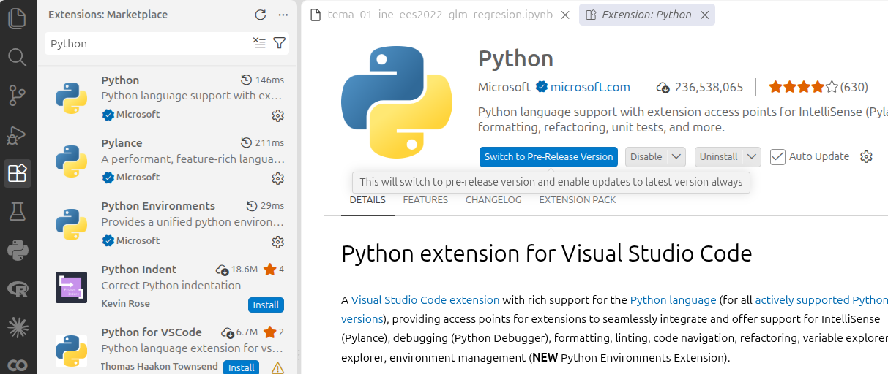
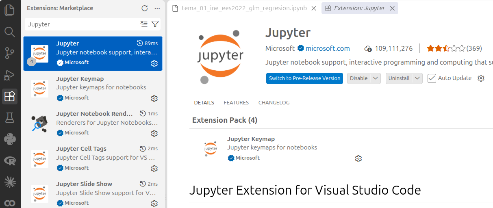

## Antes de empezar {.unnumbered}

Vas a instalar **tres cosas**, en este orden:

```{mermaid}
%%| fig-width: 8
flowchart LR
  A["<b>1. Miniconda</b><br/>Python + gestor conda<br/>(~150 MB)"] --> C["<b>3. Entorno <i>tap</i></b><br/>todas las librerías del curso<br/>(fichero tap.yml)"]
  B["<b>2. VS Code</b><br/>+ extensiones Python y Jupyter<br/>(~250 MB)"] --> D["<b>4. Conectar</b><br/>VS Code usa el entorno <i>tap</i><br/>para ejecutar notebooks"]
  C --> D
  D --> E["comprobar_entorno.ipynb<br/>dice TODO CORRECTO"]
  style A fill:#e8f0fc,stroke:#1f5fbf
  style B fill:#e8f0fc,stroke:#1f5fbf
  style C fill:#e8f0fc,stroke:#1f5fbf
  style D fill:#e8f0fc,stroke:#1f5fbf
  style E fill:#e6f4ea,stroke:#1a7f37
```

::: {.callout-important title="Qué necesitas"}
- **Espacio en disco:** 6 GB libres (el entorno ocupa unos 3,5 GB).
- **Conexión a internet:** se descargan en total unos 1,5 GB. Mejor hacerlo **en casa** con buena conexión.
- **Tiempo:** entre **20 y 45 minutos** en casa (más en la wifi del aula). Ver la [tabla de tiempos](#tiempo).
- **Ficheros del Aula Virtual:** `tap.yml` (se usa en el Paso 3), `comprobar_entorno.ipynb` y `primer_ejemplo.py` (Paso 4).
:::

::: {.callout-note title="¿Por qué Miniconda y no Anaconda?" collapse="true"}
- **Conda** es el gestor de paquetes y entornos. Es lo que necesitamos.
- **Anaconda** = conda + 1.500 paquetes preinstalados (más de 5 GB). Demasiado pesado para lo que necesitamos.
- **Miniconda** = conda + Python, y nada más (150 MB). Después instalamos **solo** las librerías del curso con el fichero `tap.yml`.

Si ya tienes **Anaconda o Miniconda** instalado, no hace falta desinstalarlo ni instalar nada más: salta al [Paso 2](#paso-2).
:::

### ¿Qué ruta debo seguir?

```{mermaid}
%%| fig-width: 8
flowchart TD
  Q1{"¿Tienes ya Anaconda o Miniconda<br/>instalado?"}
  Q1 -- "No / no lo sé" --> R1["<b>Ruta normal</b><br/>Pasos 1 → 4"]
  Q1 -- "Sí" --> R2["Salta el Paso 1.<br/>Pasos 2 → 4"]
  Q1 -- "Tengo Python instalado por otra vía<br/>(python.org, Homebrew, uv, pyenv...)<br/>y sé lo que hago" --> R3["<b>Ruta avanzada</b><br/>(al final del documento)<br/>Solo para usuarios con experiencia"]
  style R1 fill:#e6f4ea,stroke:#1a7f37
  style R2 fill:#e6f4ea,stroke:#1a7f37
  style R3 fill:#fff4e5,stroke:#b35c00
```

::: {.callout-tip}
**Para saberlo:** en Windows busca "Anaconda Prompt" en el menú Inicio; en Mac abre la Terminal y escribe `conda --version`. Si aparece algo distinto de un error, ya tienes conda.
:::

---

## Paso 1 · Instalar Miniconda <span class="tiempo">⏱ 5–8 min</span> {#paso-1}

::: {.panel-tabset}

### Windows

**1.1 Descarga** el instalador (64 bits):
[Miniconda3-latest-Windows-x86_64.exe](https://repo.anaconda.com/miniconda/Miniconda3-latest-Windows-x86_64.exe) (≈130 MB).

**1.2 Ejecuta** el `.exe` descargado (doble clic) y avanza con <span class="boton">Next</span> aceptando la licencia. Deja **todas las opciones por defecto**. Las pantallas que verás:

::: {.pantalla}
Miniconda3 Setup — Select Installation Type

- 🔘 **Just Me (recommended)**  ← deja esta
- ⚪ All Users (requires admin privileges)

<span class="boton">Next ></span>
:::

::: {.pantalla}
Miniconda3 Setup — Choose Install Location

Destination Folder: `C:\Users\TU_USUARIO\miniconda3`{.ruta}

⚠️ Si tu nombre de usuario tiene **espacios o acentos** (p. ej. "José Ángel"), cambia la carpeta a `C:\miniconda3`{.ruta}.

<span class="boton">Next ></span>
:::

::: {.pantalla}
Miniconda3 Setup — Advanced Installation Options

- ☑ Create shortcuts (supported packages only)
- ☐ Add Miniconda3 to my PATH environment variable ← **déjala sin marcar**
- ☑ Register Miniconda3 as my default Python 3.13
- ☑ Clear the package cache upon completion

<span class="boton">Install</span>
:::

Al terminar, desmarca las casillas de "Launch..." / "Getting started" y pulsa <span class="boton">Finish</span>.

**1.3 Comprueba.** En el menú Inicio busca **Anaconda Prompt (miniconda3)** y ábrelo. Es la ventana negra que usarás para todos los comandos `conda`. Escribe:

<pre class="terminal"><span class="prompt">(base) C:\Users\TU_USUARIO&gt;</span> conda --version
conda 25.x.x</pre>

Si responde con un número de versión, **Miniconda está instalado**. Fíjate en el `(base)` del principio: indica que el entorno activo es el "base".

::: {.callout-warning}
Usa siempre **Anaconda Prompt (miniconda3)**, no el "Símbolo del sistema" ni PowerShell normales: en ellos `conda` no se reconoce porque no lo hemos añadido al PATH (y así evitamos conflictos con otros Python).
:::

### macOS

**1.1 Averigua tu tipo de Mac:** menú  → *Acerca de este Mac*. Si pone **Apple M1/M2/M3/M4** es *Apple Silicon*; si pone **Intel**, es Intel.

**1.2 Descarga** el instalador gráfico `.pkg`:

- Apple Silicon: [Miniconda3-latest-MacOSX-arm64.pkg](https://repo.anaconda.com/miniconda/Miniconda3-latest-MacOSX-arm64.pkg) (≈150 MB)
- Intel: [Miniconda3-latest-MacOSX-x86_64.pkg](https://repo.anaconda.com/miniconda/Miniconda3-latest-MacOSX-x86_64.pkg)

**1.3 Ejecuta** el `.pkg` (doble clic) y avanza con <span class="boton">Continuar</span>:

::: {.pantalla}
Instalar Miniconda3 — Tipo de instalación / Destino

- 🔘 **Instalar solo para mí** ← deja esta
- ⚪ Instalar para todos los usuarios de este ordenador

<span class="boton">Instalar</span> → te pedirá la contraseña de tu Mac
:::

::: {.callout-tip}
Si macOS muestra *"No se puede abrir porque procede de un desarrollador no identificado"*: haz **clic derecho → Abrir** sobre el `.pkg` y confirma.
:::

Pulsa <span class="boton">Cerrar</span> al terminar (puedes mover el instalador a la papelera).

**1.4 Comprueba.** Abre la **Terminal** (⌘ + Espacio, escribe *Terminal*). **Importante: si ya tenías una Terminal abierta, ciérrala y abre una nueva.** Escribe:

<pre class="terminal"><span class="prompt">(base) tu-mac ~ %</span> conda --version
conda 25.x.x</pre>

Si responde con una versión y el prompt empieza por `(base)`, **Miniconda está instalado**.

:::

---

## Paso 2 · Instalar VS Code y sus extensiones <span class="tiempo">⏱ 5–10 min</span> {#paso-2}

**Visual Studio Code** es el editor donde abriremos y ejecutaremos los notebooks (`.ipynb`) y scripts (`.py`) del curso.

::: {.panel-tabset}

### Windows

**2.1 Descarga** desde [code.visualstudio.com/download](https://code.visualstudio.com/download) → botón **Windows** (User Installer, x64, ≈120 MB).

**2.2 Ejecuta** el instalador. Acepta la licencia y en la pantalla de tareas adicionales marca:

::: {.pantalla}
Instalación de Visual Studio Code — Seleccione las tareas adicionales

- ☑ Crear un acceso directo en el escritorio (opcional)
- ☑ **Agregar la acción "Abrir con Code" al menú contextual de archivos**
- ☑ **Agregar la acción "Abrir con Code" al menú contextual de directorios**
- ☑ Registrar Code como editor para los tipos de archivo admitidos
- ☑ **Agregar a PATH** (ya viene marcada)

<span class="boton">Siguiente ></span> → <span class="boton">Instalar</span>
:::

### macOS

**2.1 Descarga** desde [code.visualstudio.com/download](https://code.visualstudio.com/download) → botón **Mac** (Universal, ≈250 MB). Se descarga un `.zip` que se descomprime solo en *Descargas*.

**2.2 Arrastra** el icono azul **Visual Studio Code** desde *Descargas* a la carpeta **Aplicaciones** (en el Finder, barra lateral). Ábrelo desde *Aplicaciones* (la primera vez confirma "Abrir").

:::

**2.3 Instala las dos extensiones** (igual en Windows y Mac). Abre VS Code y pulsa <kbd>Ctrl</kbd>+<kbd>Shift</kbd>+<kbd>X</kbd> (Mac: <kbd>⌘</kbd>+<kbd>Shift</kbd>+<kbd>X</kbd>) o el icono de los cuadraditos de la barra izquierda. En la caja de búsqueda escribe el nombre y pulsa <span class="boton">Install</span>:

::: {.pantalla}
EXTENSIONS: MARKETPLACE  🔍 `Python`

- **Python** — *Microsoft* — "Python language support…" <span class="boton">Install</span>
:::



::: {.pantalla}
EXTENSIONS: MARKETPLACE  🔍 `Jupyter`

- **Jupyter** — *Microsoft* — "Jupyter notebook support…" <span class="boton">Install</span>
:::




Fíjate en que el editor sea **Microsoft** (hay copias con nombres parecidos). Opcional: la extensión **Spanish Language Pack for VS Code** pone los menús en castellano.

**2.4 Comprueba.** En la pestaña de extensiones, arriba, aparece la sección *INSTALLED* con **Python** y **Jupyter**. Si te pide *Reload*, pulsa.

---

## Paso 3 · Crear el entorno `tap` <span class="tiempo">⏱ 5–20 min (casi todo es espera)</span> {#paso-3}

El fichero **`tap.yml`** es la lista de paquetes a instalar: Python 3.11 y todas las librerías del curso (scikit-learn, XGBoost, LightGBM, SHAP, Optuna, DoubleML, TensorFlow/Keras, pandas, matplotlib, plotly…). Conda lee la lista, descarga las versiones compatibles y las instala **aisladas** en un entorno llamado `tap`. **Es el mismo fichero para Windows, Mac y Linux.**

**3.1 Descarga `tap.yml`** del Aula Virtual. Quedará en tu carpeta **Descargas** (`Downloads`). Comprueba que el nombre es exactamente `tap.yml` (Windows a veces lo guarda como `tap.yml.txt`; si es así, renómbralo).

:::: {.panel-tabset}

### Windows

**3.2 Abre Anaconda Prompt (miniconda3)** y **entra en la carpeta Descargas** con `cd Downloads`. Después lista su contenido con `dir tap.yml` para confirmar que el fichero está ahí:

<pre class="terminal"><span class="prompt">(base) C:\Users\TU_USUARIO&gt;</span> cd Downloads

<span class="prompt">(base) C:\Users\TU_USUARIO\Downloads&gt;</span> dir tap.yml
 El volumen de la unidad C es Windows
 Directorio de C:\Users\TU_USUARIO\Downloads

14/09/2026  10:32               612 tap.yml</pre>

Si aparece `tap.yml`, estás en el sitio correcto.

::: {.callout-tip title="Si has guardado tap.yml en otra carpeta" collapse="true"}
Escribe `cd ` (con un espacio) y **arrastra la carpeta** desde el Explorador hasta la ventana de la terminal: se pega la ruta sola. Pulsa <kbd>Enter</kbd>.
:::

**3.3 Revisa y acepta los términos de servicio, si se solicitan.** Conda puede pedir que aceptes los términos de los canales de Anaconda o detenerse con un error como `CondaToSNonInteractiveError`. Antes de crear el entorno, puedes consultarlos y, si estás de acuerdo, aceptarlos desde esta misma ventana:

```bash
conda tos view
conda tos accept
```

El comando está documentado en el [plugin oficial de Anaconda](https://github.com/anaconda/conda-anaconda-tos#usage). Si `conda` no reconoce el subcomando `tos`, continúa con la creación del entorno: este paso depende de que esté instalado el plugin `conda-anaconda-tos`.

**3.4 Crea el entorno** con esta línea (tarda entre 5 y 20 minutos según la conexión; **no cierres la ventana**):

```bash
conda env create -f tap.yml
```

Verás estas fases; en la de descarga aparecen barras de progreso:

<pre class="terminal"><span class="prompt">(base) C:\Users\TU_USUARIO\Downloads&gt;</span> conda env create -f tap.yml
Channels: conda-forge
Collecting package metadata (repodata.json): done
Solving environment: done
Downloading and Extracting Packages: ...
Preparing transaction: done
Verifying transaction: done
Executing transaction: done
Installing pip dependencies: ...done
<span class="prompt">   ↑ aquí instala TensorFlow: tarda unos minutos</span>
#
# To activate this environment, use
#
#     $ conda activate tap</pre>

::: {.callout-tip title="Si se interrumpe (se va la wifi, cierras la ventana...)"}
Repite el mismo comando. Si dice que el entorno ya existe: `conda env remove -n tap -y` y vuelve a crearlo. Los paquetes ya descargados no se vuelven a bajar.
:::

**3.5 Comprueba.** Activa el entorno y mira qué responde Python:

<pre class="terminal"><span class="prompt">(base) C:\Users\TU_USUARIO\Downloads&gt;</span> conda activate tap

<span class="prompt">(tap) C:\Users\TU_USUARIO\Downloads&gt;</span> python -c "import tensorflow; print('OK')"
<span class="ok">OK</span></pre>


El prompt ahora empieza por **`(tap)`**. Ese es el entorno que usaremos en toda la asignatura. (Pueden aparecer avisos de TensorFlow en mayúsculas antes del `OK`: son informativos, no errores.)

### macOS

**3.2 Abre la Terminal** (⌘ + Espacio, escribe *Terminal*) y **entra en la carpeta Descargas** con `cd Downloads`. Después lista su contenido con `ls tap.yml` para confirmar que el fichero está ahí:

<pre class="terminal"><span class="prompt">(base) tu-mac ~ %</span> cd Downloads

<span class="prompt">(base) tu-mac Downloads %</span> ls tap.yml
tap.yml</pre>

Si aparece `tap.yml`, estás en el sitio correcto.

::: {.callout-tip title="Si has guardado tap.yml en otra carpeta" collapse="true"}
Escribe `cd ` (con un espacio) y **arrastra la carpeta** desde el Finder hasta la ventana de la terminal: se pega la ruta sola. Pulsa <kbd>Enter</kbd>.
:::

**3.3 Revisa y acepta los términos de servicio, si se solicitan.** Conda puede pedir que aceptes los términos de los canales de Anaconda o detenerse con un error como `CondaToSNonInteractiveError`. Antes de crear el entorno, puedes consultarlos y, si estás de acuerdo, aceptarlos desde esta misma ventana:

```bash
conda tos view
conda tos accept
```

El comando está documentado en el [plugin oficial de Anaconda](https://github.com/anaconda/conda-anaconda-tos#usage). Si `conda` no reconoce el subcomando `tos`, continúa con la creación del entorno: este paso depende de que esté instalado el plugin `conda-anaconda-tos`.

**3.4 Crea el entorno** con esta línea (tarda entre 5 y 20 minutos según la conexión; **no cierres la ventana**):

```bash
conda env create -f tap.yml
```

Verás estas fases; en la de descarga aparecen barras de progreso:

<pre class="terminal"><span class="prompt">(base) tu-mac Downloads %</span> conda env create -f tap.yml
Channels: conda-forge
Collecting package metadata (repodata.json): done
Solving environment: done
Downloading and Extracting Packages: ...
Preparing transaction: done
Verifying transaction: done
Executing transaction: done
Installing pip dependencies: ...done
<span class="prompt">   ↑ aquí instala TensorFlow: tarda unos minutos</span>
#
# To activate this environment, use
#
#     $ conda activate tap</pre>

::: {.callout-tip title="Si se interrumpe (se va la wifi, cierras la ventana...)"}
Repite el mismo comando. Si dice que el entorno ya existe: `conda env remove -n tap -y` y vuelve a crearlo. Los paquetes ya descargados no se vuelven a bajar.
:::

**3.5 Comprueba.** Activa el entorno y mira qué responde Python:

<pre class="terminal"><span class="prompt">(base) tu-mac Downloads %</span> conda activate tap

<span class="prompt">(tap) tu-mac Downloads %</span> python -c "import tensorflow; print('OK')"
<span class="ok">OK</span></pre>


El prompt ahora empieza por **`(tap)`**. Ese es el entorno que usaremos en toda la asignatura. (Pueden aparecer avisos de TensorFlow en mayúsculas antes del `OK`: son informativos, no errores.)

::::

---

## Paso 4 · Conectar VS Code con el entorno `tap` <span class="tiempo">⏱ 5 min</span> {#paso-4}

**4.1 Crea la carpeta de la asignatura.** En el Explorador (Windows) o el Finder (Mac) crea una carpeta nueva donde vayas a guardar todo el material del curso, p. ej. `Documentos/TAP`. Descarga `comprobar_entorno.ipynb` y `primer_ejemplo.py` del Aula Virtual y muévelos a esa carpeta. Durante el curso, todos los notebooks y datos irán ahí.

**4.2 Abre la carpeta en VS Code:** menú *File → Open Folder…* (Mac: *Archivo → Abrir carpeta…*) y elige la carpeta que acabas de crear. Si pregunta si confías en los autores, pulsa <span class="boton">Yes, I trust the authors</span>. En el explorador de archivos de la izquierda aparece `comprobar_entorno.ipynb`: haz clic para abrirlo.

**4.3 Elige el kernel.** Arriba a la derecha del notebook hay un botón que dice **Select Kernel** (o el nombre de otro Python). Púlsalo y sigue esta secuencia:

::: {.pantalla}
Select Kernel

- ▸ **Python Environments…**  ← elige esta
- ▸ Jupyter Kernel…
- ▸ Existing Jupyter Server…
:::

::: {.pantalla}
Select a Python Environment

- ★ **tap (Python 3.11.x)**  `~/miniconda3/envs/tap/bin/python`{.ruta}  ← elige esta
- base (Python 3.13.x)  `~/miniconda3/bin/python`{.ruta}
:::

::: {.callout-tip}
Si `tap` no aparece en la lista: pulsa <kbd>Ctrl</kbd>+<kbd>Shift</kbd>+<kbd>P</kbd> (Mac <kbd>⌘</kbd>+<kbd>Shift</kbd>+<kbd>P</kbd>), escribe `Developer: Reload Window`, <kbd>Enter</kbd>, y vuelve a intentarlo.
:::

**4.4 Ejecuta todo:** botón <span class="boton-gris">▶▶ Run All</span> en la barra superior del notebook. La primera ejecución tarda unos 20–30 segundos en arrancar. Debe aparecer:

<pre class="terminal">Python 3.11.x  |  Windows AMD64
Ejecutable: C:\Users\TU_USUARIO\miniconda3\envs\tap\python.exe
------------------------------------------------------------
OK   numpy        2.x
OK   pandas       2.x
OK   sklearn      1.x
...
OK   tensorflow   2.x
OK   keras        3.x
------------------------------------------------------------
<span class="ok">TODO CORRECTO</span>
Keras entrena correctamente. Pérdida final: ...</pre>

y un **gráfico** al final. **Ya tienes todo instalado.**

**4.5 Scripts `.py` (los usaremos también).** Abre `primer_ejemplo.py`. Abajo a la derecha en la barra de estado aparece la versión de Python; haz clic y elige **tap**. Coloca el cursor en la primera celda `# %%` y pulsa <kbd>Shift</kbd>+<kbd>Enter</kbd>: se abre la *Interactive Window* con el resultado. El propio script explica en sus comentarios cómo seguir.

---

## Lista de verificación final {.checklist}

- Anaconda Prompt / Terminal responde a `conda --version`.
- `conda activate tap` cambia el prompt a `(tap)`.
- VS Code tiene instaladas las extensiones **Python** y **Jupyter** de Microsoft.
- En un notebook, arriba a la derecha, aparece **tap (Python 3.11.x)** como kernel.
- `comprobar_entorno.ipynb` termina con **TODO CORRECTO** y muestra el gráfico.

---

## Tiempo necesario {#tiempo}

| Paso | Descarga | Instalación | Total orientativo |
|---|---:|---:|---:|
| 1. Miniconda | 130–150 MB · 1–2 min | 2–4 min | **5–8 min** |
| 2. VS Code + 2 extensiones | 120–250 MB · 1–3 min | 3–5 min | **5–10 min** |
| 3. Entorno `tap` (≈ 300 MB conda + ≈ 650 MB TensorFlow por pip) | ≈ 1 GB · 2–10 min | 3–10 min | **5–20 min** |
| 4. Conectar VS Code + comprobación | — | 3–5 min | **5 min** |
| **Total** | ≈ 1,5 GB | | **20–45 min** |

---

## Problemas frecuentes

::: {.panel-tabset}

### Windows

**"conda" no se reconoce como un comando interno o externo.**
Estás en el Símbolo del sistema o PowerShell normal. Abre **Anaconda Prompt (miniconda3)** desde el menú Inicio. Si quieres que funcione en cualquier terminal (opcional): en Anaconda Prompt ejecuta `conda init` y abre una terminal nueva.

**El instalador falla o el entorno da errores raros de rutas.**
Nombre de usuario con espacios o acentos. Desinstala Miniconda (*Configuración → Aplicaciones*) y reinstala eligiendo la carpeta `C:\miniconda3`.

**`tap.yml` no se encuentra (`FileNotFoundError`).**
No estás en la carpeta correcta o el fichero se llama `tap.yml.txt`. En el Explorador activa *Ver → Mostrar → Extensiones de nombre de archivo* y renómbralo.

**La creación del entorno es lentísima en "Executing transaction".**
Suele ser el antivirus analizando miles de ficheros. Espera; si tarda más de 30 minutos, añade la carpeta `miniconda3` a las exclusiones del antivirus.

### macOS

**`conda: command not found` tras instalar.**
Cierra la Terminal y abre una nueva. Si persiste, ejecuta estas dos líneas y vuelve a abrir la Terminal:
```bash
source ~/miniconda3/bin/activate
conda init zsh
```

**"No se puede abrir porque procede de un desarrollador no identificado".**
Clic derecho sobre el fichero → *Abrir* → *Abrir*.

**Mac Intel (anterior a 2020): falla la instalación de TensorFlow por pip.**
Las últimas versiones de TensorFlow no tienen versión para Mac Intel; pip elige automáticamente la 2.16, que exige NumPy 1.x. Abre `tap.yml` con un editor de texto, cambia la línea `- numpy` por `- numpy<2`, borra el entorno (`conda env remove -n tap -y`) y vuelve a crearlo.

### Ambos

**Error `CondaToSNonInteractiveError` o aviso de términos de servicio pendientes.**
Consulta los términos con `conda tos view` y, si estás de acuerdo, ejecuta `conda tos accept`. Después repite `conda env create -f tap.yml` (Paso 3).

**Errores `CondaHTTPError` / `SSLError` / "Connection timed out" al crear el entorno.**
Problema de red (VPN, wifi de la universidad con proxy, red que corta descargas largas). Desactiva la VPN, cambia de red (p. ej. compartir datos del móvil un momento) y repite `conda env create -f tap.yml`.

**Termina todo menos "Installing pip dependencies" (TensorFlow).**
El entorno se ha creado pero sin TensorFlow. Instálalo a mano:
```bash
conda activate tap
pip install tensorflow
```

**En VS Code no aparece `tap` en "Select Kernel".**
1. `Developer: Reload Window` (paleta de comandos). 2. Si sigue sin aparecer, en *Select a Python Environment* elige *Enter interpreter path…* y escribe la ruta: Windows `C:\Users\TU_USUARIO\miniconda3\envs\tap\python.exe`{.ruta} · Mac `/Users/TU_USUARIO/miniconda3/envs/tap/bin/python`{.ruta}.

**VS Code pide "ipykernel needs to be installed".**
Pulsa <span class="boton">Install</span>. (Solo ocurre si has elegido un entorno que no es `tap`; comprueba el kernel.)

**Un notebook del curso da `ModuleNotFoundError`.**
Casi siempre es que el kernel seleccionado no es `tap`. Mira arriba a la derecha y cámbialo.

**Quiero empezar de cero.**
`conda env remove -n tap -y` y repite el Paso 3. Para desinstalar Miniconda por completo basta con borrar la carpeta `miniconda3`.

:::

::: {.callout-warning title="No instales paquetes 'a mano' en el entorno"}
Durante el curso no hace falta instalar nada más. `pip install` o `conda install` sueltos pueden romper dependencias. Si en algún tema necesitamos un paquete adicional, os daré un `tap.yml` actualizado y las instrucciones para recrear el entorno.
:::

---

## Ruta avanzada: ya tengo Python y no quiero conda {#avanzada}

::: {.callout-caution}
**Solo para quien ya trabaja con Python** (python.org, Homebrew, `uv`, `pyenv`…) y sabe crear entornos virtuales. El profesor no da soporte a esta ruta: si algo no funciona, la solución es la ruta normal con Miniconda. Los notebooks del curso se prueban únicamente con el entorno `tap`.
:::

Requisitos: **Python 3.10 a 3.13** (TensorFlow aún no tiene versión para Python 3.14; comprueba con `python --version`). Descarga `requirements.txt` del Aula Virtual y, en la carpeta de la asignatura:

```bash
python -m venv .venv
# Windows:
.venv\Scripts\activate
# macOS / Linux:
source .venv/bin/activate

pip install -r requirements.txt
```

En VS Code, elige `.venv` como kernel (aparece como *.venv (Python 3.x)*) y ejecuta `comprobar_entorno.ipynb`. Nota: para dibujar árboles con `graphviz` hace falta además el programa Graphviz del sistema (`brew install graphviz` en Mac, instalador de [graphviz.org](https://graphviz.org/download/) en Windows); con conda viene incluido.

---

## Chuleta de comandos conda {.unnumbered}

| Quiero… | Comando |
|---|---|
| Ver los entornos que tengo | `conda env list` |
| Activar el entorno del curso | `conda activate tap` |
| Volver al entorno base | `conda deactivate` |
| Ver los paquetes del entorno activo | `conda list` |
| Borrar el entorno | `conda env remove -n tap -y` |
| Recrearlo con un `tap.yml` nuevo | `conda env create -f tap.yml` |
| Actualizar conda (solo si se pide) | `conda update -n base conda` |
