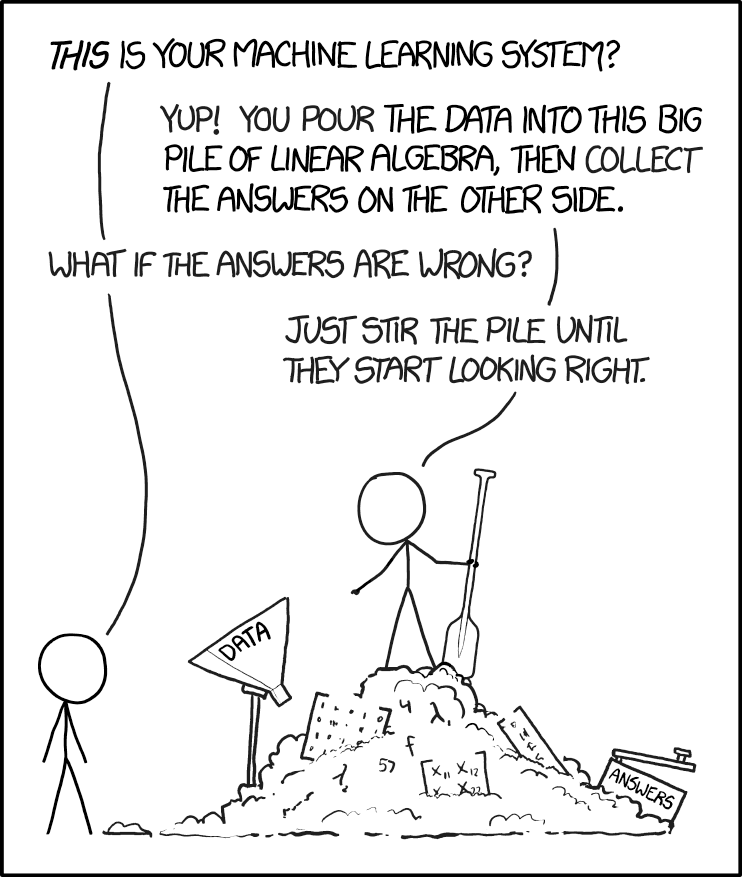

```{python}
#| echo: false
#| output: false
import sys
sys.path.insert(0, "../../../_tap_theme")
import numpy as np
import pandas as pd
import matplotlib.pyplot as plt
import tapviz as tv
from matplotlib_inline.backend_inline import set_matplotlib_formats
from sklearn.linear_model import LinearRegression
from sklearn.model_selection import train_test_split
from sklearn.tree import DecisionTreeRegressor

tv.use_style()
plt.rcParams.update({"font.size": 16, "axes.titlesize": 18,
                     "axes.labelsize": 16, "legend.fontsize": 14,
                     "xtick.labelsize": 14, "ytick.labelsize": 14})
set_matplotlib_formats("png", dpi=110)
```

## ¿Cuánto cuesta una noche en este alojamiento? {.airbnb}

```{python}
#| echo: false
#| output: false
import os
import plotly.graph_objects as go

# El perfil proyector (1280x800) renderiza aparte: el mapa se dimensiona según el perfil.
# Fondo: teselas vectoriales de CARTO (sin token), nítidas a cualquier zoom. "carto-voyager"
# es el estilo con calles, nombres y puntos de interés (aspecto OSM); "carto-positron" es el
# fondo pálido de mínimo detalle. No usar "open-street-map": los servidores voluntarios de OSM
# bloquean aplicaciones no identificadas (403, osm.wiki/blocked).
PROYECTOR = "proyector" in os.environ.get("QUARTO_PROFILE", "")
MAPA_W, MAPA_H = (1060, 430) if PROYECTOR else (1580, 640)
MAPA_ESTILO = "carto-voyager"
# Zoom con la rueda del ratón (y pellizco en pantalla táctil) más botones + / − / reinicio;
# doble clic también reinicia la vista. Sin logo ni botones de descarga.
MAPA_CONFIG = {"scrollZoom": True, "displayModeBar": True, "displaylogo": False,
               "modeBarButtons": [["zoomInMap", "zoomOutMap", "resetViewMap"]]}

# Diez anuncios reales con al menos 20 reseñas y precio entre 30 y 400 €; selección reproducible.
cols = ["neighbourhood_group_cleansed", "room_type", "latitude", "longitude",
        "accommodates", "number_of_reviews", "review_scores_rating", "price",
        "bathrooms", "bedrooms", "beds", "minimum_nights", "availability_365",
        "host_is_superhost"]
df = pd.read_csv("../../../../datos/airbnb_vlc/listados.csv", usecols=cols)
df["price"] = pd.to_numeric(df.price.str.replace(r"[$,]", "", regex=True))
lat0, lon0 = 39.4699, -0.3763
df["dist_km"] = np.sqrt(((df.latitude - lat0) * 111.0) ** 2
                        + ((df.longitude - lon0) * 111.0 * np.cos(np.radians(lat0))) ** 2)
ok = df[(df.number_of_reviews >= 20) & df.price.between(30, 400)]
G, R = ok.neighbourhood_group_cleansed, ok.room_type

def pick(mask, seed):
    return ok[mask].sample(1, random_state=seed)

muestra = pd.concat([
    pick((G == "CIUTAT VELLA") & (R == "Entire home/apt"), 3),
    pick((G == "L'EIXAMPLE") & (R == "Private room"), 5),
    pick((G == "POBLATS MARITIMS") & (R == "Entire home/apt"), 7),
    pick((ok.dist_km > 4) & (R == "Entire home/apt"), 11),
    pick((G == "EXTRAMURS") & (R == "Private room"), 13),
    pick((G == "CIUTAT VELLA") & (R == "Private room"), 17),
    pick((G == "BENIMACLET") & (R == "Entire home/apt"), 19),
    pick((G == "CAMINS AL GRAU") & (R == "Entire home/apt"), 23),
    pick((G == "QUATRE CARRERES") & (R == "Private room"), 29),
    pick((G == "LA SAIDIA") & (R == "Entire home/apt"), 31),
]).reset_index(drop=True)
anuncios = pd.DataFrame({
    "n": range(1, len(muestra) + 1),
    "Distrito": muestra.neighbourhood_group_cleansed.str.title(),
    "Tipo": muestra.room_type.map({"Entire home/apt": "Entero", "Private room": "Habitación"}),
    "Centro (km)": muestra.dist_km.map(lambda v: f"{v:.1f}".replace(".", ",")),
    "Personas": muestra.accommodates.astype(int),
    "Reseñas": muestra.number_of_reviews.astype(int),
    "Valoración / 5": muestra.review_scores_rating.map(lambda v: f"{v:.1f}".replace(".", ",")),
    "€/noche": muestra.price.astype(int),
    "lat": muestra.latitude, "lon": muestra.longitude,
})

def mapa_anuncios(m, con_precio=False):
    """Mapa de Valencia con los anuncios; el precio solo aparece si con_precio."""
    hover = ("<b>Anuncio %{text}</b><br>%{customdata[0]}, %{customdata[1]}"
             "<br>Centro: %{customdata[2]} km · %{customdata[3]} personas"
             "<br>Reseñas: %{customdata[4]} · Valoración: %{customdata[5]}/5")
    datos = m[["Distrito", "Tipo", "Centro (km)", "Personas", "Reseñas", "Valoración / 5"]].copy()
    marcador = dict(size=24, color=tv.TERRACOTTA)
    if con_precio:
        hover += "<br><b>%{customdata[6]} €/noche</b>"
        datos["precio"] = m["€/noche"]
        marcador = dict(size=24, color=m["€/noche"], showscale=True,
                        colorscale=[[0, tv.SAGE], [0.5, tv.GOLD], [1, tv.TERRACOTTA]],
                        colorbar=dict(title="€/noche", thickness=18, len=0.8))
    fig = go.Figure(go.Scattermap(
        lat=m.lat, lon=m.lon, mode="markers+text", text=m.n.astype(str),
        textposition="top center", textfont=dict(size=22, color=tv.NAVY, family="Open Sans Bold"),
        marker=marcador, customdata=datos.values,
        hovertemplate=hover + "<extra></extra>",
    ))
    fig.update_layout(
        map=dict(style=MAPA_ESTILO, center=dict(lat=39.466, lon=-0.362),
                 zoom=11.9 if PROYECTOR else 12.4),
        width=MAPA_W, height=MAPA_H, margin=dict(l=0, r=0, t=0, b=0),
        hoverlabel=dict(font_size=16 if PROYECTOR else 20, bgcolor="white", font_family="Roboto"),
    )
    return fig
```

:::{.panel-tabset}

### Los datos

```{python}
#| echo: false
mapa_anuncios(anuncios).show(config=MAPA_CONFIG)
```

::: {.caption-line}
Pasad el ratón por cada anuncio (rueda o botones + / − para acercar el mapa). **¿Cuál es el más caro y cuál el más barato? Justificad la elección con dos variables.**
:::

### Los precios

```{python}
#| echo: false
mapa_anuncios(anuncios, con_precio=True).show(config=MAPA_CONFIG)
```

::: {.caption-line}
**Respuesta:** precio. **Predictores:** distrito, tipo, distancia, capacidad, reseñas y valoración. Aprender es obtener una regla que prediga bien anuncios nuevos.
:::

:::

:::{.source}
Fuente: Inside Airbnb, listado de Valencia disponible en los datos del curso. Distancia aproximada a la Plaza del Ayuntamiento. Mapa: © CARTO, © colaboradores de OpenStreetMap.
:::

:::{.notes}
Dinámica (4 min). Un minuto individual, contraste breve por parejas, dos justificaciones y revelación en la pestaña "Los precios". Preguntar qué información adicional habría ayudado. Los diez anuncios son reales (al menos 20 reseñas, precio entre 30 y 400 €); no son una muestra representativa del mercado. Los datos aparecen al pasar el ratón; el mapa se acerca con la rueda o los botones + / − (doble clic o el botón de inicio restablecen la vista). El fondo se descarga de CARTO al abrir la slide (sin red, los puntos siguen visibles sobre fondo blanco).

Precios el 17-09-2026 (anuncio: €/noche): 1 Ciutat Vella entero 104; 2 L'Eixample habitación 51; 3 Poblats Marítims entero 197; 4 lejos del centro entero 140; 5 Extramurs habitación 43; 6 Ciutat Vella habitación 54; 7 Benimaclet entero 81; 8 Camins al Grau entero 160; 9 Quatre Carreres habitación 59; 10 La Saidia entero 86. Los caros son enteros y con más capacidad; la distancia al centro no ordena por sí sola (el 3 y el 4 están lejos y son caros: playa).

Con una forma lineal, esto es una regresión hedónica: ya conocen una herramienta de aprendizaje supervisado. La asignatura amplía las formas de modelizar y enfatiza la evaluación fuera de muestra. No hacen falta cientos de variables para que exista aprendizaje automático.

El precio observado es el precio anunciado. Predecirlo no identifica el precio que maximizaría los ingresos. Para un anuncio recién creado, reseñas y valoración todavía no estarían disponibles: el momento de predicción determina qué variables podemos usar. Retomar esta cuestión en el cierre y en prácticas.
:::

## Tres preguntas

&nbsp;

1. **¿Qué es aprender de los datos?** Identificar respuesta y predictores, y distinguir una predicción de un efecto causal.
2. **¿Cómo sabemos si un modelo predice bien?** Detectar sobreajuste y justificar una comparación con datos nuevos.
3. **¿Cómo se entrena un modelo?** Interpretar una actualización del gradiente y el papel del tamaño del lote.

> Al terminar, volveremos a Airbnb para elegir entre tres modelos entrenados con los datos del curso.

:::{.notes}
Recorrido de 60 min: gancho y Airbnb, 5; mapa y bloque 1, 12; bloque 2, 24; bloque 3, 13; recapitulación y actividad final, 6.

Las dos slides interactivas (pyodide) del bloque 2 son opcionales: si la red del aula falla, las figuras estáticas anteriores cubren el mismo contenido. Si la sesión efectiva dura 50 min, continuar el bloque de optimización al inicio del laboratorio y conservar la actividad final.

Las preguntas anticipan el Tema 2 (evaluación), los métodos de los Temas 3–6 y el Tema 7 (causalidad).
:::

# ¿Qué es aprender de los datos? {background-color="#447099"}

## IA, aprendizaje automático y aprendizaje profundo

&nbsp;

| Concepto | Qué describe | Ejemplo |
|---|---|---|
| **Inteligencia artificial (IA)** | Sistemas que realizan tareas asociadas a la inteligencia | Reconocer caras |
| **Aprendizaje automático (ML)** | Métodos de IA que aprenden a partir de datos | Aprender un clasificador usando ejemplos |
| **Aprendizaje profundo (DL)** | Métodos de ML basados en redes neuronales de múltiples capas | Aprender representaciones de imágenes |

**Aprendizaje estadístico:** perspectiva estadística sobre cómo aprender de los datos y evaluar la incertidumbre.

:::{.notes}
Una sola taxonomía, sin cronología adicional. IA contiene ML, y ML contiene DL. El curso se centra en aprendizaje supervisado, con redes neuronales en el Tema 6.

ML y aprendizaje estadístico tienen un amplio solapamiento. Su diferencia de tradición no implica que el segundo sea todo el marco teórico del primero. Tampoco el tamaño del conjunto de datos distingue por sí solo ML de econometría.
:::

## ¿Qué queremos aprender? {.body-callout}

&nbsp;

:::{.columns}
:::{.column width="48%"}
| Datos disponibles | Tarea |
|---|---|
| Predictores y respuesta numérica | **Regresión**: predecir el precio anunciado |
| Predictores y una categoría | **Clasificación**: predecir el abandono de un cliente |
| Características sin respuesta objetivo | **No supervisada**: agrupar alojamientos similares |

Las dos primeras son tareas **supervisadas**: aprendemos con respuestas conocidas.
:::
:::{.column width="4%"}
:::
:::{.column width="48%"}
::: {.callout-tip title="Para pensar"}
¿Predecir el precio y agrupar alojamientos por sus características requieren la misma información?
:::

::: {.callout-note title="Otros paradigmas"}
Semisupervisado, activo y reforzado aprenden con otro tipo de información. No forman parte del recorrido del curso.
:::
:::
:::

:::{.notes}
Pedir una respuesta breve: para entrenar el predictor del precio hacen falta precios observados; para agrupar, no hace falta esa respuesta objetivo. Los estudiantes ya conocen agrupamiento y PCA.

Otros paradigmas, si preguntan: el semisupervisado aprovecha muchos datos sin etiqueta y pocos etiquetados; en aprendizaje activo el algoritmo decide qué observaciones conviene anotar; en aprendizaje reforzado un agente observa un estado, elige una acción y recibe una recompensa, y aprende una política que maximiza la recompensa acumulada (los asistentes conversacionales se afinan con una variante de este esquema).
:::

## Predecir y estimar un efecto causal {.body-callout}

&nbsp;

:::{.columns}
:::{.column width="48%"}
| Objetivo predictivo | Objetivo causal |
|---|---|
| ¿Quién tiene más probabilidad de abandonar? | Una campaña de retención de clientes, ¿en quien reduce más su probabilidad de abandono? |
| Evaluar aciertos en clientes nuevos | Comparar qué ocurriría con y sin intervención |
| Necesita una evaluación representativa del uso | Necesita supuestos que identifiquen el efecto |

**Las herramientas pueden coincidir.** Una regresión sirve para predecir y el ML puede ayudar a estimar efectos causales.
:::
:::{.column width="4%"}
:::
:::{.column width="48%"}
::: {.callout-tip title="Para pensar"}
¿Dirigiríais la campaña necesariamente a los clientes con más riesgo de abandono?
:::
:::
:::

:::{.notes}
No necesariamente: los de mayor riesgo pueden no responder a la campaña. El efecto incremental y los costes importan para decidir. Ascarza (2018, *Retention Futility*, JMR) desarrolla esta diferencia; se retoma en el Tema 7.

Breiman (2001, *The Two Cultures*) y Mullainathan y Spiess (2017, JEP) ayudan a distinguir objetivos, sin establecer dos disciplinas incompatibles. Un coeficiente beta no tiene interpretación causal por el mero hecho de pertenecer a una regresión. No todos los modelos predictivos son cajas negras.
:::

## El problema de predicción {.body-callout}

&nbsp;

Usando el ejemplo de *Airbnb*, $X$ contiene las características del alojamiento e $y$ es su precio:

$$y = f(X) + \epsilon,\qquad f(X)=E(y\mid X),\qquad E(\epsilon\mid X)=0.$$

:::{.columns}
:::{.column width="48%"}
**$f(X)$:** precio medio para unas características dadas.

**$\hat f(X)$:** regla que estimamos con una muestra.

**$\epsilon$:** variación del precio que esas características no permiten anticipar.
:::
:::{.column width="4%"}
:::
:::{.column width="48%"}
::: {.callout-note title="Dos fuentes de error"}
Podemos mejorar la estimación de $f$. El ruido que permanece dado $X$ limita la precisión.
:::
:::
:::

:::{.notes}
Preguntar qué diferencias quedan entre dos alojamientos del mismo distrito, tipo y capacidad: decoración, vistas, equipamiento o decisiones del anfitrión. El error es irreducible respecto de la información X disponible; incorporar información pertinente puede reducirlo.

Definimos f como media condicional en regresión con pérdida cuadrática. Esto no impone una relación causal ni una forma lineal. El objetivo es predecir y nuevo mediante f estimada.
:::

## Una recta y un árbol sobre los mismos datos {.fig-wide}

```{python}
#| fig-alt: "Dos paneles con los mismos datos y la función seno verdadera. La recta aproxima globalmente; el árbol de profundidad dos predice una constante en cada región."
X_c, y_c = tv.simulate_sin(n=150, noise=0.35, seed=0)
xx = np.linspace(-3, 3, 600).reshape(-1, 1)
recta = LinearRegression().fit(X_c, y_c)
arbol = DecisionTreeRegressor(max_depth=2, random_state=0).fit(X_c, y_c)
fig, axes = plt.subplots(1, 2, figsize=(16, 6.5), sharey=True)
for ax, modelo, titulo, color in zip(
    axes, (recta, arbol), ("Recta: una fórmula global", "Árbol: predicción por regiones"),
    (tv.BLUE, tv.TERRACOTTA)
):
    ax.scatter(X_c, y_c, s=20, color=tv.GRAY, alpha=0.45, label="datos")
    ax.plot(xx, np.sin(xx[:, 0]), "k--", lw=2, label="f verdadera")
    ax.plot(xx, modelo.predict(xx), color=color, lw=2.7, label="ajuste")
    ax.set_title(titulo)
    ax.set_xlabel("x")
axes[0].set_ylabel("y")
fig.legend(*axes[0].get_legend_handles_labels(), loc="lower center", ncol=3)
fig.tight_layout(rect=(0, 0.08, 1, 1))
plt.show()
```


:::{.notes}
La recta tiene una forma prefijada y dos parámetros. El árbol divide el espacio y estima una respuesta por región (cortes y medias de las hojas). Son ejemplos de modelos paramétrico y no paramétrico, respectivamente; global/local no es una definición general de esas categorías. Un polinomio de grado fijado también es paramétrico y puede ser flexible.

La función será sin(x) también en las siguientes simulaciones; la muestra y el ruido pueden cambiar, y se indicarán.

Puente al bloque 2: mirar el ajuste a los puntos disponibles no permite saber por sí solo cuál funcionará mejor con datos nuevos.
:::

# ¿Cómo sabemos si un modelo predice bien? {background-color="#447099"}

## ¿Qué error medimos? {.body-callout}

&nbsp;

:::{.columns}
:::{.column width="48%"}
El **error cuadrático medio** (ECM o MSE) resume los errores de predicción:

$$\mathrm{MSE}=\frac{1}{n}\sum_{i=1}^{n}\left(y_i-\hat f(x_i)\right)^2.$$

- **Entrenamiento:** medimos sobre los datos usados para ajustar.
- **Validación:** medimos sobre otros datos para comparar modelos.
:::
:::{.column width="4%"}
:::
:::{.column width="48%"}
::: {.callout-note title="Sobreajuste"}
Un ajuste excelente en entrenamiento puede empeorar las predicciones en datos nuevos.
:::

::: {.callout-note title="Unidades"}
En Airbnb, el MSE se mide en $(\text{€/noche})^2$. Un error de 10 €/noche aporta 100.
:::
:::
:::

:::{.notes}
Aquí x_i son los predictores e y_i la respuesta observada. Basta un ejemplo verbal para interpretar la fórmula.

En familias anidadas, minimizar exactamente la misma pérdida de entrenamiento no puede dar un mínimo mayor al ampliar la familia. Esto no garantiza que un algoritmo numérico encuentre ese mínimo ni que baje el error de validación. Más adelante distinguiremos validación de prueba final.
:::

## Subajuste y sobreajuste, a la vista {.fig-wide}

```{python}
#| fig-alt: "Polinomios de grado 1, 3 y 15. Sus MSE de entrenamiento disminuyen; el de validación es menor para el grado 3 que para los grados 1 y 15."
X, y = tv.simulate_sin(n=50, noise=0.8, seed=42)
X_train, _, y_train, _ = train_test_split(X, y, test_size=0.3, random_state=42)
# Evaluación independiente y amplia, con la misma distribución de ruido.
rng_val = np.random.default_rng(2026)
X_val = rng_val.uniform(-3, 3, (2000, 1))
y_val = np.sin(X_val[:, 0]) + rng_val.normal(0, 0.8, len(X_val))
fig = tv.plot_degrees(X_train, y_train, X_val, y_val, f=np.sin,
                      degrees=(1, 3, 15), eval_label="validación", figsize=(16, 6.5))
plt.show()
```

::: {.caption-line}
35 observaciones de entrenamiento y 2.000 de validación (se dibujan 45). **¿Qué grado elegiríais?** Explicad por qué el menor error de entrenamiento no basta.
:::

:::{.notes}
Respuesta: entre estos candidatos y según esta validación, grado 3. El grado 1 pierde curvatura; el 15 reduce más el error de entrenamiento, pero predice peor fuera de muestra que el 3.

La evaluación cubre el intervalo [-3,3]. El entrenamiento usa posiciones prefijadas de ese intervalo, con ruido independiente. En esta demostración de regresión condicional no extrapolamos fuera del rango observado.

El escalado a [-1,1] se aprende dentro del Pipeline, solo con X_train. Mantiene la familia polinómica y evita perder rango numérico en las potencias altas. No abrir este detalle de cálculo durante la explicación conceptual.

No se afirma que el grado 15 pierda siempre en cualquier muestra. La slide siguiente permite probar otros grados y la posterior repite muestras.
:::

## Elige el grado {.fig-full}

<button class="pyodide-toggle">Mostrar código</button> <span class="pyodide-estado"></span>

```{pyodide-python}
#| autorun: true
#| classes: pyodide-fold
grado = 3        # cambia el grado (1, 3, 8, 15...) y pulsa Run
n = 35           # observaciones de entrenamiento
ruido = 0.8      # desviación típica del ruido

import numpy as np
import matplotlib.pyplot as plt
from sklearn.pipeline import make_pipeline
from sklearn.preprocessing import MinMaxScaler, PolynomialFeatures
from sklearn.linear_model import LinearRegression

rng = np.random.default_rng(42)
X = np.linspace(-3, 3, n).reshape(-1, 1)
y = np.sin(X[:, 0]) + rng.normal(0, ruido, n)
X_val = rng.uniform(-3, 3, (2000, 1))
y_val = np.sin(X_val[:, 0]) + rng.normal(0, ruido, 2000)

modelo = make_pipeline(MinMaxScaler((-1, 1)),
                       PolynomialFeatures(grado, include_bias=False),
                       LinearRegression()).fit(X, y)
mse = lambda A, b: np.mean((modelo.predict(A) - b) ** 2)

xx = np.linspace(-3, 3, 400).reshape(-1, 1)
fig, ax = plt.subplots(figsize=(13, 6), dpi=110)
ax.scatter(X, y, s=40, color="#6C757D", alpha=0.7, label="entrenamiento")
ax.plot(xx, np.sin(xx[:, 0]), "k--", lw=1.8, label="f verdadera")
ax.plot(xx, modelo.predict(xx), color="#447099", lw=2.8, label=f"grado {grado}")
ax.set_ylim(-3, 3)
ax.set_xlabel("x"); ax.set_ylabel("y")
ax.set_title(f"Grado {grado}: MSE entrenamiento {mse(X, y):.2f} · validación {mse(X_val, y_val):.2f}",
             fontsize=15)
ax.legend(loc="upper right", frameon=False)
for s in ("top", "right"):
    ax.spines[s].set_visible(False)
plt.tight_layout()
plt.show()
```

:::{.notes}
Slide interactiva (2 min). Mostrar el código, cambiar `grado` a 1, 8 y 15 y ejecutar; anotar en la pizarra los dos MSE de cada grado. Preguntar antes de ejecutar qué esperan que pase con cada error.

Requiere red: el runtime de Python se descarga al abrir la slide (20-40 s). Si no carga, la slide anterior contiene el mismo experimento con tres grados fijos.

Misma receta que la figura estática: escalado a [-1,1] dentro del Pipeline y polinomio sin término independiente propio (lo añade la regresión). La semilla fija hace comparables los grados: solo cambia la familia, no los datos.
:::

## La varianza: entrenar con otra muestra {.fig-wide}

```{python}
#| fig-alt: "Cinco rectas y cinco polinomios de grado 15, ajustados a las mismas cinco muestras independientes. Las predicciones del grado 15 cambian más."
X_diseno = np.linspace(-3, 3, 35).reshape(-1, 1)
fig = tv.plot_sample_bundle(X_diseno, np.sin, noise=0.8,
                            degrees=(1, 15), n_samples=5, seed=2026,
                            figsize=(16, 6.5))
plt.show()
```

::: {.caption-line}
Mismos valores de $x$ y misma regla, con nuevas respuestas ruidosas en cada muestra. **¿Qué modelo cambia más? ¿Ser estable basta para predecir bien?**
:::

:::{.notes}
La variación relevante es la de las predicciones al repetir el entrenamiento, no la dispersión de las observaciones. Las rectas cambian poco, pero no capturan la curvatura: estabilidad y buen ajuste a f son propiedades distintas.

Ambos métodos reciben las mismas cinco muestras independientes de 35 respuestas. Así se evita mezclar la intuición con bootstrap o con cambios de tamaño muestral. La slide siguiente permite aumentar n y ver que el haz se estrecha.
:::

## Varias muestras y el tamaño muestral {.fig-full}

<button class="pyodide-toggle">Mostrar código</button> <span class="pyodide-estado"></span>

```{pyodide-python}
#| autorun: true
#| classes: pyodide-fold
grado = 15        # grado del polinomio flexible (el panel izquierdo usa grado 1)
n = 35            # observaciones por muestra: prueba con 35, 100 y 500
n_muestras = 5    # muestras independientes
ruido = 0.8

import numpy as np
import matplotlib.pyplot as plt
from sklearn.pipeline import make_pipeline
from sklearn.preprocessing import MinMaxScaler, PolynomialFeatures
from sklearn.linear_model import LinearRegression

rng = np.random.default_rng(2026)
X = np.linspace(-3, 3, n).reshape(-1, 1)
xx = np.linspace(-3, 3, 400).reshape(-1, 1)
muestras = [np.sin(X[:, 0]) + rng.normal(0, ruido, n) for _ in range(n_muestras)]
# un color por muestra (el mismo en los dos paneles)
colores = ["#447099", "#E07A5F", "#81B29A", "#C9A227", "#8E5C9E", "#1F3A5F"]

fig, axes = plt.subplots(1, 2, figsize=(14, 6), dpi=110, sharey=True)
for ax, d in zip(axes, (1, grado)):
    for k, y in enumerate(muestras):
        m = make_pipeline(MinMaxScaler((-1, 1)),
                          PolynomialFeatures(d, include_bias=False),
                          LinearRegression()).fit(X, y)
        ax.plot(xx, m.predict(xx), color=colores[k % len(colores)], alpha=0.85, lw=2,
                label="un ajuste por muestra" if k == 0 else None)
    ax.plot(xx, np.sin(xx[:, 0]), "k--", lw=2, label="f verdadera")
    ax.set_ylim(-2.5, 2.5)
    ax.set_title(f"Grado {d}: {n_muestras} muestras de n = {n}", fontsize=15)
    ax.set_xlabel("x")
    for s in ("top", "right"):
        ax.spines[s].set_visible(False)
axes[0].set_ylabel("predicción")
axes[0].legend(loc="upper left", frameon=False)
plt.tight_layout()
plt.show()
```

:::{.notes}
Slide interactiva (3 min). Con n = 35 el haz del grado 15 es ancho. Subir n a 100 y a 500: el haz se estrecha (menos varianza) y sigue centrado en f (el sesgo del grado 15 es pequeño). Subir después el grado con n = 35 para volver a ampliar el haz.

Mensaje: la varianza depende de la complejidad y del tamaño muestral. Más datos informativos permiten modelos más flexibles; con pocos datos conviene restringir la familia. Es la intuición que justifica la regularización.

Si la red falla, la figura estática anterior muestra el caso n = 35; el efecto del tamaño muestral puede enunciarse verbalmente y comprobarse en el laboratorio.
:::

## Descomposición del error de predicción {.dense}

&nbsp;

Para un $x$ nuevo, promediamos sobre muestras de entrenamiento y sobre el ruido de la nueva respuesta:

$$E[(y-\hat f(x))^2]=
\underbrace{\left(E[\hat f(x)]-f(x)\right)^2}_{\text{sesgo}^2}
+\underbrace{\mathrm{Var}(\hat f(x))}_{\text{varianza}}
+\underbrace{\sigma^2}_{\text{ruido irreducible}}.$$

| Componente | Qué describe |
|---|---|
| **Sesgo** | Distancia entre la predicción media del método y $f(x)$ |
| **Varianza** | Cuánto cambia la predicción entre muestras |
| **Ruido** | Variación de $y$ que permanece incluso conociendo $f(x)$ |

:::{.notes}
No demostrar la identidad. Volver a las rectas y al haz de curvas para dar significado a cada término.

La fórmula usa pérdida cuadrática, ruido de media condicional cero y varianza constante sigma², como en nuestras simulaciones. Si la varianza depende de X, el último término es Var(epsilon | X=x). La esperanza de f estimada se toma sobre los entrenamientos posibles.

En Airbnb, mejor estimación y más variables pertinentes pueden ayudar de formas diferentes: la primera reduce error de estimación; las segundas pueden reducir el ruido condicionado a la información disponible.
:::

## Sesgo, varianza y complejidad {.fig-side}

:::{.columns}
:::{.column width="52%"}
```{python}
#| echo: false
#| fig-alt: "Esquema conceptual: al aumentar la complejidad baja el sesgo cuadrado, aumenta la varianza y el error total tiene un mínimo intermedio."
fig = tv.plot_bias_variance_schematic(figsize=(9, 6.8))
plt.show()
```
:::
:::{.column width="4%"}
:::
:::{.column width="44%"}
**Subajuste:** el método no puede representar $f$; el sesgo domina.

**Sobreajuste:** el método sigue el ruido de la muestra; la varianza domina.

> Aceptar algo de sesgo puede reducir suficientemente la varianza.

::: {.callout-tip title="Para pensar"}
¿Dónde situaríais la recta y el polinomio de grado 15 en este esquema?
:::
:::
:::

:::{.notes}
Esquema cualitativo, no una medición ni una ley universal sobre todas las familias de ML. La curva en U es útil para estos ejemplos; no se promete monotonía de cada componente en cualquier modelo.

Respuesta: la recta a la izquierda (sesgo alto, varianza baja); el grado 15 a la derecha con n = 35. Con n = 500 el mismo grado 15 se desplaza hacia el mínimo porque su varianza cae: la posición depende también del tamaño muestral.
:::

## Controlar la complejidad {.table-slide .dense}

&nbsp;

**Regularizar** es limitar la flexibilidad del ajuste. Puede mejorar la generalización; lo comprobamos con datos de validación.

::: {tbl-colwidths="[30,60,10]"}
| Familia | Control de complejidad | Tema |
|---|---|:--:|
| Polinomios | Elegir el grado | 1 |
| Modelos lineales regularizados | Penalizar los coeficientes (ridge, LASSO) | 3 |
| Árboles y ensambles | Profundidad y datos por hoja; en boosting, tasa de aprendizaje y número de árboles | 4 |
| Máquinas de vectores de soporte | Coste $C$ de los errores y anchura del núcleo | 5 |
| Redes neuronales | Penalización, dropout o parada temprana | 6 |
:::

**Parámetros:** valores que aprende el modelo durante el ajuste. **Hiperparámetros:** controlan el proceso de ajuste y, en muchos casos, determinan la flexibilidad del estimador elegido.

:::{.notes}
Se introduce regularización después del problema que ayuda a resolver. El grado puede entenderse como restricción de la clase de funciones. Un hiperparámetro no es un coeficiente de la regresión, aunque se seleccione a partir de datos.

Ensambles: en bagging y bosques aleatorios, más árboles reducen la varianza sin añadir complejidad al modelo medio (promedian); la complejidad se controla con la profundidad y el número de predictores por corte. En boosting, cada árbol corrige al anterior: más árboles y mayor tasa de aprendizaje sí aumentan la capacidad de ajuste, por eso se combinan con parada temprana.

SVM: C grande penaliza más cada error y ajusta más a la muestra; un núcleo más estrecho (gamma grande en RBF) hace la frontera más flexible.

LASSO puede llevar coeficientes a cero; ridge los contrae sin seleccionar variables de la misma manera. No todos los algoritmos llevan un regularizador explícito ni toda regularización mejora cualquier muestra.
:::

## Validar para elegir, probar para evaluar {.body-callout}

&nbsp;

:::{.columns}
:::{.column width="48%"}
| Entrenamiento | Validación | Prueba final |
|---|---|---|
| Ajustar parámetros | Elegir modelo e hiperparámetros | Evaluar el modelo elegido |
| Aprender la regla | Comparar alternativas | Mantenerla fuera de las decisiones |

La **validación cruzada** repite la comparación usando distintos pliegues dentro de los datos de desarrollo. La veremos en el Tema 2.
:::
:::{.column width="4%"}
:::
:::{.column width="48%"}
::: {.callout-tip title="Para pensar"}
Si cambiamos el grado después de mirar el error de prueba, ¿sigue siendo una evaluación final independiente?
:::
:::
:::

:::{.notes}
No: ese conjunto ya ha influido en una decisión. La independencia relevante incluye selección, preprocesado y decisiones del analista, no solo la llamada a fit.

Con validación cruzada, se ajusta con k-1 pliegues y se valida con el restante, rotando y promediando. El conjunto de prueba final permanece aparte. La partición debe representar el uso: si hay tiempo, grupos o dependencia, no basta con barajar filas. Fuente: documentación de scikit-learn sobre cross-validation.

Puente: ya sabemos cómo comparar modelos. Ahora veremos cómo obtener los parámetros de uno de ellos.
:::

# ¿Cómo se entrena un modelo? {background-color="#447099"}

## Ajustar los parámetros minimizando una pérdida {.body-callout}

&nbsp;

:::{.columns}
:::{.column width="48%"}
Un modelo paramétrico $f(x;\theta)$ predice con un vector de parámetros $\theta$: los coeficientes de una recta, los de una regresión logística o los pesos de una red neuronal.

Elegimos $\theta$ para minimizar una **pérdida** sobre la muestra:

$$L(\theta)=\frac{1}{n}\sum_{i=1}^{n}(y_i-f(x_i;\theta))^2.$$

El **descenso del gradiente** actualiza los parámetros paso a paso:

$$\theta^{(t+1)}=\theta^{(t)}-\alpha\,\nabla_\theta L(\theta^{(t)}).$$
:::
:::{.column width="4%"}
:::
:::{.column width="48%"}
::: {.callout-note title="Gradiente y tasa"}
$\nabla_\theta L$: dirección de mayor aumento de la pérdida. $\alpha$: tamaño del paso en la dirección contraria.
:::

::: {.callout-note title="Más allá de los parámetros"}
Boosting también minimiza una pérdida: añade árboles que siguen su gradiente (Tema 4). Un árbol aislado no se entrena así.
:::
:::
:::

:::{.notes}
La pérdida cuadrática es la de regresión; en clasificación se usa otra (entropía cruzada, Tema 3). Un modelo regularizado añade a L una penalización sobre theta.

Con mínimos cuadrados existe una solución directa; el gradiente permite entender el entrenamiento iterativo, que reaparece en regresión logística, SVM y redes neuronales. Los árboles se construyen con cortes voraces, no con esta receta; el gradient boosting la recupera a nivel del ensamble, tomando cada árbol nuevo como un "paso" en la dirección del gradiente de la pérdida.

El objetivo numérico es minimizar la pérdida de la muestra, no recuperar exactamente los coeficientes poblacionales. Serán próximos si la información disponible lo permite.
:::

## Una actualización del gradiente {.fig-side}

:::{.columns}
:::{.column width="52%"}
```{python}
#| echo: false
#| fig-alt: "Pérdida cuadrática con mínimo en theta igual a 1,5. Desde theta igual a menos 0,5, los pasos avanzan hacia el mínimo."
fig = tv.plot_gd_1d(alpha=0.35, start=-0.5, steps=4, center=1.5, figsize=(9, 6.8))
plt.show()
```
:::
:::{.column width="4%"}
:::
:::{.column width="44%"}
Para $L(\theta)=(\theta-\theta^*)^2$ con $\theta^*=1{,}5$, el gradiente es $2(\theta-\theta^*)$.

Con $\theta^{(0)}=-0{,}5$ y $\alpha=0{,}35$:

$$\theta^{(1)}=-0{,}5-0{,}35\times(-4)=0{,}9.$$

Un paso reduce $L$ de $4$ a $0{,}36$.

::: {.callout-tip title="Para pensar"}
Si empezáramos en $\theta=3$, ¿en qué dirección daríamos el primer paso? ¿Y con $\alpha=1$?
:::
:::
:::

:::{.notes}
Dar 30 segundos antes de responder: en theta = 3 el gradiente es positivo (+3) y restarlo desplaza theta hacia la izquierda. Se comprueba el signo, no solo que sepan repetir una fórmula.

Con alpha = 1 el paso es 2(theta - theta*) completo: desde 3 saltamos a 0 y desde 0 a 3, oscilando sin converger. Con alpha demasiado pequeña avanzamos despacio. La trayectoria depende también de la curvatura de la pérdida.

El mínimo no está en cero a propósito: el valor óptimo de un parámetro es lo que buscamos, no un número especial.
:::

## Regresión lineal: tres formas de calcular el paso {.fig-wide}

```{python}
#| code-fold: true
#| code-summary: "Código: simulación y tres versiones del descenso"
#| output: false
# Simulamos y = 4 + 3x + ruido, con n = 100.
rng = np.random.default_rng(0)
x = 2 * rng.random(100)
y_lin = 4 + 3 * x + rng.normal(0, 1, len(x))
X_lin = np.c_[np.ones(len(x)), x]
malla = tv.cost_grid(X_lin, y_lin)
ajuste_mco = LinearRegression().fit(x.reshape(-1, 1), y_lin)
beta_opt = np.r_[ajuste_mco.intercept_, ajuste_mco.coef_]

def descenso_gradiente(X, y, alpha=0.05, n_iter=300):
    """Por lotes: un paso por pasada completa sobre los datos."""
    beta = np.zeros(X.shape[1])
    camino = [beta.copy()]
    for _ in range(n_iter):
        # Derivada de (1/2n) * suma de cuadrados; misma solución que el MSE.
        gradiente = X.T @ (X @ beta - y) / len(y)
        beta = beta - alpha * gradiente
        camino.append(beta.copy())
    return beta, np.array(camino)

def descenso_estocastico(X, y, alpha=0.01, epochs=10, batch_size=1, seed=0):
    """Con batch_size=1 es estocástico; con 1 < batch_size < n, por minilotes."""
    rng = np.random.default_rng(seed)
    beta = np.zeros(X.shape[1])
    camino = [beta.copy()]
    for _ in range(epochs):
        orden = rng.permutation(len(y))
        for s in range(0, len(y), batch_size):
            lote = orden[s:s + batch_size]
            gradiente = X[lote].T @ (X[lote] @ beta - y[lote]) / len(lote)
            beta = beta - alpha * gradiente
            camino.append(beta.copy())
    return beta, np.array(camino)

beta_gd, camino_gd = descenso_gradiente(X_lin, y_lin)
beta_sgd, camino_sgd = descenso_estocastico(X_lin, y_lin)
beta_mb, camino_mb = descenso_estocastico(X_lin, y_lin, alpha=0.05, epochs=30, batch_size=10)
```

```{python}
#| echo: false
#| fig-alt: "Trayectorias por lotes, estocástica y por minilotes, con los mismos ejes y contornos. Una cruz señala el mínimo de la pérdida muestral y un cuadrado el último paso."
fig, axes = plt.subplots(1, 3, figsize=(16, 6.2), sharex=True, sharey=True)
for ax, titulo, camino in zip(
    axes, ("Lotes", "Estocástico", "Minilotes"),
    (camino_gd, camino_sgd, camino_mb)
):
    tv.plot_contour_path(malla, camino, title=titulo, optimum=beta_opt, ax=ax)
    ax.set_xlim(0, 5)
    ax.set_ylim(0, 4.2)
fig.legend(*axes[0].get_legend_handles_labels(), loc="lower center", ncol=3)
fig.tight_layout(rect=(0, 0.08, 1, 1))
plt.show()
```

::: {.caption-line}
$y=4+3x+\epsilon$, $n=100$; los ejes son $\beta_0$ y $\beta_1$. **Paso:** una actualización. **Epoch:** una pasada completa por los datos.
:::

:::{.notes}
Primero interpretar los ejes beta0 y beta1: el gráfico muestra parámetros, no observaciones x e y. La cruz es el mínimo muestral de mínimos cuadrados, aproximadamente (3,993; 2,935), y no los parámetros poblacionales (4,3).

La pérdida representada es MSE/2, que tiene el mismo mínimo. Por lotes: alpha=0,05, 300 epochs; estocástico: alpha=0,01, 10 epochs; minilotes de 10: alpha=0,05, 30 epochs. Son trayectorias ilustrativas con presupuestos diferentes, no una prueba de velocidad entre implementaciones.

El estocástico puede mantener ruido alrededor del mínimo con tasa constante; una curva con ruido no implica por sí sola que esté sobreajustando. El código completo está plegado en la slide, para el laboratorio.
:::

## Lotes, estocástico y minilotes {.body-callout}

&nbsp;

:::{.columns}
:::{.column width="48%"}
| | Por lotes | Estocástico | Minilotes |
|---|---|---|---|
| Datos por paso | Todos ($n$) | Uno | Un lote ($m$) |
| Pasos por epoch | 1 | $n$ | $\lceil n/m\rceil$ |
| Gradiente | Completo | Ruidoso | Promedio del lote |
| Uso habitual | Datos manejables | Flujo de datos | Gran escala |

Con 1.000 observaciones y lotes de 100, un epoch contiene **10 pasos**.
:::
:::{.column width="4%"}
:::
:::{.column width="48%"}
::: {.callout-tip title="Para pensar"}
Para entrenar con millones de transacciones, ¿qué ventaja tendría usar minilotes?
:::
:::
:::

:::{.notes}
Procesar lotes evita cargar simultáneamente todas las observaciones y permite operaciones matriciales eficientes. El modelo y el estado del optimizador también consumen memoria. El tamaño del lote afecta al ruido del gradiente y al aprovechamiento del hardware.

Más epochs pueden reducir la pérdida de entrenamiento sin mejorar validación. En modelos flexibles, parar antes puede regularizar. En esta regresión lineal, seguir aproximándonos al mínimo no implica que aparezca necesariamente sobreajuste.
:::

## Tasa de aprendizaje y ruido de las actualizaciones {.fig-side}

:::{.columns}
:::{.column width="52%"}
```{python}
#| echo: false
#| fig-alt: "Descenso estocástico con tasa constante 0,1. Las actualizaciones oscilan cerca del mínimo muestral."
beta_sgd2, camino_sgd2 = descenso_estocastico(X_lin, y_lin, alpha=0.1, epochs=10)
fig = tv.plot_contour_path(malla, camino_sgd2, optimum=beta_opt,
                           figsize=(9, 6.8), title="Estocástico con α = 0,1 constante")
plt.show()
```
:::
:::{.column width="4%"}
:::
:::{.column width="44%"}
Misma simulación, tasa diez veces mayor que en la slide anterior.

Una tasa constante puede mantener oscilaciones alrededor del mínimo.

> Reducir $\alpha$ durante el entrenamiento ayuda a afinar el ajuste.

::: {.callout-tip title="Para pensar"}
¿Es este ruido un síntoma de sobreajuste?
:::
:::
:::

:::{.notes}
Comparar con la tasa 0,01 del panel estocástico anterior. En SGD, el ruido del gradiente persiste aunque estemos cerca del mínimo: cada paso usa una sola observación.

Respuesta: no. Las oscilaciones son un fenómeno de optimización (cómo buscamos el mínimo de la pérdida de entrenamiento); el sobreajuste es estadístico (el mínimo encontrado predice mal fuera de muestra). Pueden coexistir o no.
:::

## Descenso del gradiente: aspectos prácticos {.dense}

&nbsp;

- **Escalado:** diferencias grandes de escala entre predictores deforman los contornos y frenan la optimización. Estandarizar ayuda.
- **Parada:** combinar un máximo de iteraciones con una tolerancia sobre la pérdida o el gradiente.
- **Parada temprana:** en modelos flexibles, vigilar la pérdida de validación y detener antes de que la generalización empeore.
- **Tasa de aprendizaje:** una planificación decreciente o un optimizador adaptativo modifica los pasos durante el entrenamiento.

> En scikit-learn y Keras estas decisiones son hiperparámetros del estimador; en el laboratorio veremos dónde se fijan.

:::{.notes}
Estandarizar no garantiza contornos circulares. La correlación entre predictores también condiciona la geometría. La tolerancia sobre un único cambio de pérdida puede ser engañosa en SGD ruidoso, por lo que se usan criterios que tengan en cuenta varias iteraciones.

La pérdida de validación sirve para decisiones de parada y ajuste; no reutilizar para ello la prueba final. La estandarización se ajusta dentro del Pipeline con los datos de entrenamiento de cada partición.
:::

## Recapitulación

&nbsp;

1. **Aprender:** estimar una regla para casos nuevos. El objetivo determina los datos que necesitamos.
2. **Evaluar:** comparar fuera del entrenamiento. Sesgo y varianza ayudan a entender por qué la complejidad no siempre mejora la predicción.
3. **Entrenar:** ajustar parámetros minimizando una pérdida. El gradiente usa pasos cuyo tamaño y lote debemos controlar.

> En el laboratorio construiremos el modelo y comprobaremos estas decisiones con datos.

:::{.notes}
Un minuto. No releer todo. Pedir que cada estudiante identifique cuál de las tres preguntas le resulta todavía menos clara. La actividad siguiente comprueba si pueden aplicar lo aprendido al caso de apertura.
:::

## Volvemos a Airbnb: tres modelos, ¿cuál usaríais? {.body-callout .dense}

```{python}
#| code-fold: true
#| code-summary: "Código: preprocesado, partición y tres modelos"
#| output: false
from sklearn.compose import ColumnTransformer
from sklearn.impute import SimpleImputer
from sklearn.pipeline import Pipeline
from sklearn.preprocessing import OneHotEncoder
from lightgbm import LGBMRegressor

datos = df[df.price.between(30, 400)
           & df.room_type.isin(["Entire home/apt", "Private room"])].copy()
datos["superhost"] = (datos.host_is_superhost == "t").astype(int)
categoricas = ["neighbourhood_group_cleansed", "room_type"]
numericas = ["dist_km", "accommodates", "bathrooms", "bedrooms", "beds",
             "number_of_reviews", "review_scores_rating", "minimum_nights",
             "availability_365", "superhost"]
X_ab = datos[categoricas + numericas]
y_ab = np.log(datos.price)                      # respuesta en logaritmos
X_ab_tr, X_ab_va, y_ab_tr, y_ab_va = train_test_split(
    X_ab, y_ab, test_size=0.3, random_state=42)

preproceso = ColumnTransformer([
    ("cat", OneHotEncoder(handle_unknown="ignore"), categoricas),
    ("num", SimpleImputer(strategy="median"), numericas),
])
candidatos = {
    "Regresión lineal": LinearRegression(),
    "Árbol sin podar": DecisionTreeRegressor(random_state=0),
    "LightGBM (300 árboles)": LGBMRegressor(n_estimators=300, learning_rate=0.05,
                                            num_leaves=15, random_state=0, verbose=-1),
}
filas = []
for nombre, modelo in candidatos.items():
    ajuste = Pipeline([("prep", preproceso), ("modelo", modelo)]).fit(X_ab_tr, y_ab_tr)
    filas.append({
        "Modelo": nombre,
        "MSE entrenamiento": np.mean((ajuste.predict(X_ab_tr) - y_ab_tr) ** 2),
        "MSE validación": np.mean((ajuste.predict(X_ab_va) - y_ab_va) ** 2),
    })
resultados = pd.DataFrame(filas)
n_tr, n_va = len(y_ab_tr), len(y_ab_va)
```

:::{.columns}
:::{.column width="48%"}
Tres modelos entrenados con los anuncios de Valencia, sin ajustar hiperparámetros. Respuesta: $\log(\text{precio})$.

```{python}
#| echo: false
#| output: asis
print(tv.md_table(resultados, floatfmt="{:.3f}"))
print(f"\nEntrenamiento: {n_tr:,} anuncios. Validación: {n_va:,}.".replace(",", "."))
```
:::
:::{.column width="4%"}
:::
:::{.column width="48%"}
::: {.callout-tip title="Para pensar"}
Elegid un modelo y justificadlo. ¿Qué nos dice el error de entrenamiento del árbol? ¿Qué datos reservaríais para comunicar la precisión final?
:::
:::
:::

:::{.notes}
Actividad de salida (5–6 min). Respuesta individual por escrito (1), contraste por parejas (1), recoger dos argumentos y resolver (3–4). Si hay Wooclap disponible, puede usarse sin cambiar la tarea.

Criterios observables: elige LightGBM por su menor error de validación; explica que el MSE de entrenamiento nulo del árbol sin podar es memorización (una hoja por anuncio), no capacidad predictiva; pide un conjunto de prueba representativo que no haya influido en la selección.

Lectura de las cifras (se calculan al renderizar; valores del 17-09-2026: regresión 0,136/0,139; árbol 0,000/0,205; LightGBM 0,078/0,111). En escala log, la raíz del MSE de validación es un error multiplicativo típico: exp(sqrt(0,11)) ≈ 1,40, es decir, un 40 % arriba o abajo del precio anunciado, frente a 1,45 en la regresión y 1,57 en el árbol.

Precisión: una sola partición no mide por separado sesgo y varianza ni demuestra que LightGBM funcione mejor en todo contexto; la validación cruzada del Tema 2 estabiliza la comparación. Ningún hiperparámetro se ha ajustado aquí. Si el destino son anuncios nuevos, reseñas y valoraciones no están disponibles al predecir: habría que redefinir el conjunto de variables y volver a validar.

Si la mayoría escoge el árbol, volver a la figura de los tres polinomios al empezar el laboratorio. Si confunde validación y prueba, repasar la separación de funciones antes del primer ajuste.
:::

## {background-color="#447099"}

:::{.closing}
{fig-alt="Viñeta de xkcd: un sistema de aprendizaje automático aparece como una pila de álgebra lineal que se ajusta con datos."}
:::
