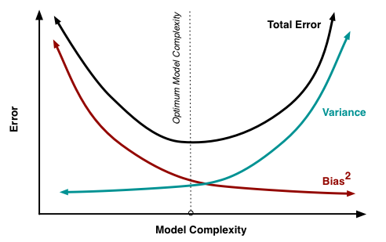
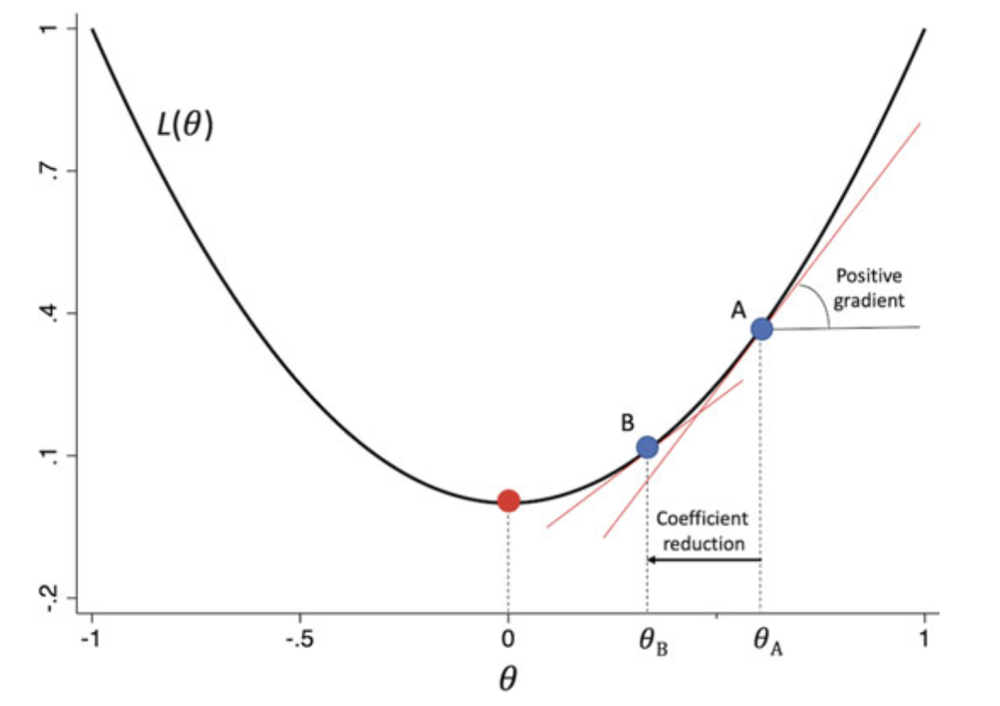

# 1. Aprendizaje automático {background-color="#447099"}

<h2>Técnicas avanzadas de predicción en negocios</h2>

<h3>Prof.Juan D. Montoro-Pons \| 2025/26</h3>


# Introducción {background-color="#447099"}

## Aprendizaje automático y aprendizaje estadístico {style="color:#447099"}

&nbsp; 

* **Aprendizaje automático:** diseño/uso de algoritmos entrenados con datos orientados a la realización de tareas complejas (IA).

* **Aprendizaje estadístico:** marco teórico (modelos estadísticos) para el aprendizaje automático.


:::{.callout-note title=Características}

El aprendizaje automático

1.  Convierte el concepto de inteligencia en un ejercicio predictivo:

    - Especificar qué se va a predecir (respuesta)
    - Especificar qué se va a usar para predecir (características,
    predictores o variables explicativas)

2. Se basa en la disponibilidad de datos:

    - Abundantes (*big data*:  $N$ y/o $K$)
    - (y/o) diversos (estructurados y no estructurados)


3. Usa modelos estadísticos adaptados para trabajar en un entorno de alta 
dimensionalidad (donde el número de predictores puede ser mayor que el número 
de observaciones)

:::

:::{.notes}

**Artificial Intelligence (AI)**: AI refers to the broader concept of machines being able to carry out tasks in a way that we would consider "smart." It involves creating systems that can perform tasks that typically require human intelligence, such as visual perception, speech recognition, decision-making or language translation.

**Machine Learning (ML)**: ML is a branch of AI that focuses on the development of algorithms and statistical models that enable computers to learn from and make predictions or decisions based on data. Essentially, it's about teaching computers to learn from data and improve their performance (usually predictive performance) over time without being explicitly programmed for each task.

While most people use them interchangeably, AI would be the general concept while ML refers to the specific models that are used to that end.

**Statistical learning** drawing from the fields of statistics and functional analysis. Statistical learning theory deals with the statistical inference problem of finding a predictive function based on data

In summary, while AI is the overarching concept of machines performing intelligent tasks, ML is a specific approach within AI that uses data and algorithms to enable machines to learn and improve from experience. Statistical learning can be seen as the foundation on which machine learning is built upon

Cerulli (2023)

> In the literature, the two terms, Machine Learning and statistical learning, are
used interchangeably. The term Machine Learning, however, was initially coined and
used by engineers and computer scientists. Historically, this term was popularized
by Samuel (1959) in his famous article on the use of experience-based learning
machines for playing the game of checkers as opposed to the symbolic/knowledge-
based learning machines relying on hard-wired programming rules. Samuel proved
that teaching a machine increasingly complex rules to carry out intelligent tasks
(as in the case of expert systems) was a much less efficient strategy than letting
the machine learn from experience, that is, from data. As a consequence, he made
the point that statistical learning is at the basis of a better ability of machines to
learn from past (stored) events. We may say, in this sense, that Machine Learning
is based on statistical learning. Of course, the use of either term also reflects the
scientific community of developers, with engineers preferring mainly to use the
label “Machine” Learning, and statisticians the label “statistical” learning.

:::


---


## Tipos de tareas  {style="color:#447099"}

&nbsp; 

1. **Aprendizaje Supervisado**: entrenamiento de un modelo con un conjunto de datos etiquetado.

   - **Regresión**: predicción de valores continuos (p. ej., precios de viviendas).
   - **Clasificación**: predicción de etiquetas discretas (p. ej., detección de fraude en reclamaciones de seguros).

2. **Aprendizaje No Supervisado**: intentar aprender la estructura subyacente de datos no etiquetados.
    
   - **Clustering (Agrupamiento)**: agrupar puntos de datos similares (p. ej., segmentación de clientes).
   - **Reducción de Dimensionalidad**: reducir el número de variables aleatorias (p. ej., PCA).

3. **Aprendizaje Semisupervisado**: uso de datos etiquetados y no etiquetados (con etiquetado es costoso).

4. **Aprendizaje Activo**: uso de datos etiquetados y no etiquetados, incluyendo interacción humana para etiquetar casos específicos.


:::{.notes}

1. Supervised learning: predictive tasks when response is either numerical (regression) or categorical (classification),

2. Unsupervised learning: no response, only features. clustering or data reduction

3. Semi-supervised learning: It is particularly useful when acquiring a fully labeled dataset is expensive. Consider labelling patient records into different disease categories (e.g., lung cancer or not) and labelling all records is unfeasible (due to costs). Here's how semi-supervised learning can be applied:

    - Label a small dataset: A small portion of the patient records is manually labeled with the correct disease category (e.g., diabetes, heart disease, cancer).
    - Train an initial model: A machine learning model, such as a neural network, is trained on this labeled dataset.
    - Generate pseudo-labels: The trained model is used to predict labels (pseudo-labels) for the unlabeled data.
    - Iterative training: The model is then retrained on the combined dataset: the original labeled data and the newly labeled data with pseudo-labels.
    - Confidence threshold: Only the predictions with high confidence are added to the training set. This helps to prevent the model from learning from incorrect labels.  

4. Active learning: same case as semi-supervised but with human labelling of those units where the model is most uncertain about the labeling.

:::

## Aprendizaje reforzado {style="color:#447099"}


> Paradigma donde un agente aprende a tomar decisiones mediante su interacción con un entorno, recibiendo recompensas o castigos según sus acciones.

- **Componentes principales**:
  - **Agente**: Algoritmo diseñado para la toma decisiones.
  - **Entorno**: Sistema con el que interactúa el agente.
  - **Acciones**: Decisiones que puede tomar el agente.
  - **Recompensa**: Señal numérica que indica el éxito o fracaso de una acción.
  - **Política**: Estrategia que sigue el agente para elegir acciones.
  - **Función de valor**: Estima la utilidad futura de un estado o acción.

- **Objetivo**: Maximizar la recompensa acumulada a largo plazo.

- **Características clave**:
  - Aprendizaje basado en prueba y error.
  - No requiere datos etiquetados, sino retroalimentación del entorno.
  - Puede manejar entornos dinámicos y secuenciales.


# Predicción, relación sesgo/varianza y complejidad {background-color="#447099"}

## Aprendizaje supervisado: predicción y errores  {style="color:#447099"}

&nbsp;


Supongamos una relación entre una respuesta $y$ y un conjunto de $k$ predictores $X=(X_1,X_2,\ldots,X_k)$ tal que:

$$y = f(X) + \epsilon$$

$f$ es la media condicional de la respuesta, es decir:

$$E(y|X) = f(X)$$

:::{.callout-note title="Aprendizaje supervisado (tarea predictiva)"}
- **Objetivo**: estimar $f$ con fines predictivos, de modo que $\hat{y} = \hat{f}(X)$.

- La precisión de las predicciones depende de:

  - **Error reducible** ($\hat{f}$ no es una estimación perfecta de $f$).
  - **Error irreducible** (variabilidad inesperada).
:::


## Los ingredientes del aprendizaje supervisado {style="color:#447099"}

&nbsp; 


1. Una forma funcional $f$.

2. Añadimos  **regularización** para controlar la complejidad del modelo (objetivo: no ajustar el ruido $\epsilon$).

3. Un proceso de **ajuste de los hiperparámetros** que controlan la regularización, es decir,  elección empírica de la cantidad de regularización que introducimos.

4. Estrategia de división de muestra y **remuestreo** (p. ej., *validación cruzada*) para la selección de los componentes (hiperparámtros y forma funcional) del algoritmo de aprendizaje estadístico.

&nbsp; 

> Un algoritmo de aprendizaje automático es una **forma funcional + regularizador**.


:::{.notes}
El objetivo de la regularización es mantener la complejidad bajo control. Los modelos de ML pueden volverse extraordinariamente complejos.

**Ejemplo**

1) Considera un modelo de regresión lineal. Podemos ajustar perfectamente los datos cuando $k=n$ (un modelo saturado). En este caso, el modelo predeciría perfectamente la muestra, pero sería inútil para cualquier otro propósito. El papel de la regularización sería retener solo las variables relevantes (RELEVANTES = aquellas que tienen rendimiento predictivo fuera de la muestra).

¿Cómo elegir empíricamente las variables relevantes? Incluir en la función objetivo (minimizar SSR) una penalización por el número de parámetros estimados en el modelo (bueno, no es exactamente eso: penaliza la suma de los coeficientes, dado el conjunto de datos normalizado). Esto es el LASSO (*least absolute shrinkage and selection operator*). En lugar de minimizar la suma de cuadrados, haremos:

$$\min \sum (y_i - x_i^T\beta)^2 + \lambda \, \sum|\beta_j|$$

2) Ahora el modelo se estima eligiendo un nivel de regularización (en este caso seleccionando el valor de $\lambda$). Cuanto mayor sea $\lambda$, mayor será la penalización sobre los coeficientes y (se puede demostrar) más coeficientes $\beta$ se llevarán a cero (LASSO se introduce precisamente como un mecanismo de selección).

En este contexto, $\lambda$ es un **hiperparámetro**. ¿Qué valor elegimos? La respuesta en ML es simple: haz que sea un proceso basado en datos. Selecciona el valor que produzca el modelo que mejor funcione en un conjunto de datos NO VISTO (es decir, cuyas predicciones sean mejores).

3) El problema: no tenemos un conjunto de datos NO VISTO. Aquí entra el TERCER TRUCO: crear pliegues (*folds*) de la muestra original, p. ej., 5 pliegues.
   - Toma una cuadrícula de valores para $\lambda$. Para cada valor repite:
     - Ejecuta el modelo usando los pliegues 1,2,3,4.
     - Predice en el pliegue 5. Calcula el MSE de la predicción (u otra métrica).
     - Repite para todas las combinaciones posibles dejando uno de los pliegues.
     - Promedia el MSE en las 5 predicciones.
   - Elige la penalización $\lambda$ que minimice el MSE (o la métrica que elijamos).

:::

##  *Trade-offs* en el aprendizaje supervisado {style="color:#447099"}

&nbsp;

- Predicción vs. inferencia
- Flexibilidad vs. interpretabilidad
- Sesgo vs. varianza

## Estimación de $f$  {style="color:#447099"}

&nbsp; 


1. **Métodos paramétricos**:

   - Introducen supuestos sobre la forma funcional $f$ 
   - Utilizan un procedimiento (descenso del gradiente)
   para aprender (estimar) los parámetros de $f$
   a partir de una función de pérdida (métrica que resume la 
   diferencia entre predicciones y respuesta observada) 
   - Formula un modelo global para la relación entre respuesta 
   y predictores

2. **Métodos no paramétricos**:

   - No hacen supuestos sobre $f$, pero proporcionan una estimación que se acerque lo más posible a los puntos de los datos de entrenamiento  
   - Son más flexibles, ya que pueden producir una amplia gama de formas para estimar $f$, PERO requieren un gran número de observaciones (habitualmente más que los métodos paramétricos a excepción de los modelos de aprendizaje profundo)
   - Se basan en el ajuste local a los valores de respuesta y predictores 

&nbsp;


:::{.notes}
:::

## Métodos paramétricos vs. no-paramétricos: ejemplo  {style="color:#447099"}

&nbsp;


```{r}
#| echo: false
os_info = Sys.info()["sysname"]
if (os_info == "Darwin") {
  # macOS (entorno base de anaconda)
  Sys.setenv(RETICULATE_PYTHON = "/Users/jd/anaconda3/bin/python")
} else {
  # Linux y otros sistemas operativos (entorno base de anaconda)
  Sys.setenv(RETICULATE_PYTHON = "/home/juande/anaconda3/bin/python")
}

```

:::{.panel-tabset}

## Modelo paramétrico

```{python}
#| code-fold: true
# Ajuste global (paramétrico) vs ajuste local (no paramétrico)
# - Modelo paramétrico: Regresión lineal (global)
# - Modelo no paramétrico: Árbol de decisión (local por regiones)

import numpy as np
import matplotlib.pyplot as plt
from sklearn.linear_model import LinearRegression
from sklearn.tree import DecisionTreeRegressor, plot_tree

# -------------------------------------------------
# Simular datos (no lineales)
# -------------------------------------------------
rng = np.random.default_rng(0)

n = 150
X = np.linspace(-3, 3, n).reshape(-1, 1)

def f(x):
    # función "verdadera" no lineal (suave)
    return np.sin(1.2 * x) + 0.3 * x

y_true = f(X[:, 0])
y = y_true + rng.normal(0, 0.35, size=n)  # añadir ruido

# Malla para trazar líneas suaves de predicción
xx = np.linspace(X.min(), X.max(), 600).reshape(-1, 1)
y_true_grid = f(xx[:, 0])

# -------------------------------------------------
# Ajustar modelo
# -------------------------------------------------
# Paramétrico (global): regresión lineal
lin = LinearRegression()
lin.fit(X, y);
y_lin_grid = lin.predict(xx)

# No paramétrico (local): árbol de decisión
tree = DecisionTreeRegressor(max_depth=3, random_state=0)
tree.fit(X, y);
y_tree_grid = tree.predict(xx)

# -------------------------------------------------
# Gráfico del ajuste por regresión lineal
# -------------------------------------------------
plt.figure(figsize=(9, 5.5))
plt.scatter(X, y, s=25, alpha=0.6, label="Datos simulados")
plt.plot(xx, y_true_grid, "k--", lw=2, alpha=0.8, label="f(x) verdadera (desconocida)")
plt.plot(xx, y_lin_grid, color="#1f77b4", lw=2.5, label="Regresión lineal (ajuste global)")
plt.title("Ajuste global (paramétrico): Regresión lineal")
plt.xlabel("X")
plt.ylabel("y / predicción")
plt.legend()
plt.grid(True, alpha=0.25)
plt.tight_layout()
plt.show()

```


## Modelo no paramétrico (predicciones)

```{python}
#| code-fold: true

# -------------------------------------------------
# Ajustar modelo
# -------------------------------------------------

# No paramétrico (local): árbol de decisión
tree = DecisionTreeRegressor(max_depth=2, random_state=0)
tree.fit(X, y);
y_tree_grid = tree.predict(xx)


# -------------------------------------------------
# Gráfico del ajuste por árbol de decisión
# -------------------------------------------------
plt.figure(figsize=(9, 5.5))
plt.scatter(X, y, s=25, alpha=0.6, label="Datos simulados")
plt.plot(xx, y_true_grid, "k--", lw=2, alpha=0.8, label="f(x) verdadera (desconocida)")
plt.plot(xx, y_tree_grid, color="#2ca02c", lw=2.5, label="Árbol de decisión (ajuste local)")
plt.title("Ajuste local (no paramétrico): Árbol de decisión")
plt.xlabel("X")
plt.ylabel("y / predicción")
plt.legend()
plt.grid(True, alpha=0.25)
plt.tight_layout()
plt.show()


```

## Modelo no paramétrico (reglas)

```{python}
#| code-fold: true

# -------------------------------------------------
# Visualización de la estructura del árbol de decisión
# -------------------------------------------------
plt.figure(figsize=(10, 6))
plot_tree(
    tree,
    filled=True,
    rounded=True,
    feature_names=["X"],
    impurity=False,     # oculta gini/MSE para simplificar
    proportion=True     # muestra proporción de muestras por nodo
)
plt.title("Estructura del árbol de decisión (reglas locales por regiones)")
plt.tight_layout()
plt.show()

```

:::

## Evaluación de la calidad predictiva {style="color:#447099"}

&nbsp;

En un contexto de regresión, la medida más utilizada para evaluar la calidad predictiva es:

$$MSE = \frac{1}{n}\sum_i (y_i - \hat{f}(x_i))^2$$

Pero, ¿qué MSE?

- **MSE de entrenamiento** (se espera que sea razonablemente bueno, o al menos mejor que…)
- **MSE del conjunto de prueba** (en datos no utilizados para el entrenamiento)

> **Sobreajuste (Overfitting)**: MSE pequeño en el conjunto de entrenamiento pero grande en el conjunto de prueba debido a un exceso de flexibilidad (menos flexibilidad habría producido un MSE de prueba más pequeño).

## Evaluación de la calidad predictiva {style="color:#447099"}

&nbsp;
Se puede mostrar que:

$$MSE = E[(y - \hat{f}(x))^2] = \mathrm{Var}(\hat{f}(x)) + \left(\mathrm{Sesgo}(\hat{f}(x))\right)^2 + \mathrm{Var}(\epsilon)$$

- **Varianza de $\hat{f}$**: variabilidad en $\hat{f}$, es decir, cuánto cambiarían las predicciones si se entrenara con un conjunto de datos diferente. Un modelo con alta varianza es extremadamente sensible a los datos (relacionado con el sobreajuste). Generalmente, la flexibilidad y la varianza de los métodos están positivamente relacionadas.

- **Sesgo de $\hat{f}$**: errores sistemáticos en las predicciones del modelo. Surgen porque aproximamos la relación entre $y$ y $X$ mediante una clase funcional específica (hacemos supuestos simplificadores) que puede ser más simple que el mecanismo real, lo que provoca que el modelo subajuste los datos. En general, métodos más flexibles resultan en menor sesgo.

La minimización del MSE requiere un método que produzca baja varianza y bajo sesgo (que típicamente están inversamente relacionados con la complejidad del modelo). Al configurar un modelo, se puede introducir sesgo de manera que disminuya la varianza lo suficiente como para reducir el error cuadrático medio total.

:::{.notes}
:::

## Complejidad y relación  sesgo-varianza  {style="color:#447099"}


{fig-align="center"}

:::{.notes}

:::


## Relación Sesgo-Varianza: ejemplo  {style="color:#447099"}


:::{.panel-tabset}
## Predicciones en el conjunto de prueba


```{python}
#| code-fold: true
import numpy as np
import matplotlib.pyplot as plt
from sklearn.preprocessing import PolynomialFeatures
from sklearn.linear_model import LinearRegression
from sklearn.neighbors import KNeighborsRegressor
from sklearn.model_selection import train_test_split
from sklearn.tree import DecisionTreeRegressor

# Generate synthetic data
np.random.seed(42)
X = np.linspace(-3, 3, 50).reshape(-1,1)  # Feature is reshaped to create a 2D array with one column!
y = np.sin(X[:,0]) + np.random.normal(0, 0.8, X.shape[0])  # True function + noise. Note that X is a 2D array so we must pick one columns 
# y = np.sin(X).ravel() + np.random.normal(0, 0.8, X.shape[0])  # Alternatively one can flatten the 2D array with ravel  

# Train-test split
X_train, X_test, y_train, y_test = train_test_split(X, y, test_size=0.3, random_state=42)
plt.figure(figsize=(12, 5))
degrees = [1, 3,15]  # Polynomial degrees

for i, d in enumerate(degrees, 1):
    poly = PolynomialFeatures(degree=d)
    X_poly = poly.fit_transform(X_train)
    
    model = LinearRegression()
    model.fit(X_poly, y_train)
    
    X_test_poly = poly.transform(X_test)
    y_pred = model.predict(X_test_poly)
    
    plt.subplot(1, 3, i)
    plt.scatter(X_train, y_train, color='gray', label='Train Data')
    plt.scatter(X_test, y_test, color='red', label='Test Data')
    plt.plot(np.sort(X_test.ravel()), y_pred[np.argsort(X_test.ravel())], label=f'Degree {d}', lw=2)
    plt.plot(X, np.sin(X), label='True Function', linestyle='dashed', color='black')
    plt.title(f'Polynomial Regression (Degree {d})')
    plt.legend()

plt.tight_layout()
plt.show()


```

## Error conjunto de prueba


```{python}
#| code-fold: true

from mlxtend.evaluate import bias_variance_decomp

# Function to fit polynomial models
def fit_polynomial(degree):
    poly_features = PolynomialFeatures(degree=degree) # creates polinomial and interaction terms up to degree selected
    X_train_poly = poly_features.fit_transform(X_train)
    X_test_poly = poly_features.transform(X_test)
    model = LinearRegression()
    model.fit(X_train_poly, y_train)
    y_pred = model.predict(X_test_poly)
    return y_pred

# Degrees of polynomials to evaluate
degrees = [1, 2, 3, 4, 5, 6, 7, 8]  # Extended range

# Calculate bias and variance for each degree
mse_scores = []
bias_scores = []
variance_scores = []
predictions_dict = {}

for degree in degrees:
    poly_features = PolynomialFeatures(degree=degree)
    X_train_poly = poly_features.fit_transform(X_train)
    X_test_poly = poly_features.transform(X_test)

    mse, bias, var = bias_variance_decomp(
        LinearRegression(), 
        X_train_poly, 
        y_train, 
        X_test_poly, 
        y_test, 
        loss='mse', 
        num_rounds=500,  # bootstrapped 
        random_seed=1
    )
    
    mse_scores.append(mse)
    bias_scores.append(bias)
    variance_scores.append(var)
    predictions_dict[f'Degree_{degree}'] = fit_polynomial(degree)

# Plot the results
plt.figure(figsize=(10, 6))
plt.plot(degrees, mse_scores, label='MSE')
plt.plot(degrees, bias_scores, label='Bias^2')
plt.plot(degrees, variance_scores, label='Variance')

# Find the plynomial degree that minimizes the MSE
min_mse_index = mse_scores.index(min(mse_scores))
min_mse_degree = degrees[min_mse_index]

# Add a vertical dashed line at the degree that minimizes MSE
plt.axvline(x=min_mse_degree, color='r', linestyle='--', label=f'Min MSE Degree = {min_mse_degree}')

# Add plot labels etc
plt.xlabel('Polynomial Degree')
plt.ylabel('Score')
plt.legend()
plt.title('Bias-Variance Trade-off')
plt.show()
```
:::


## Visualizing overfitting {style="color:#447099" visibility="hidden"}

SACAR CÓDIGO Y DEJARLO COMO ACTIVIDAD?

```{python}

import numpy as np
import matplotlib.pyplot as plt

# Function to fit a line to 2D points
def fit_line(X, Y):
    # Fit a line y = mx + b
    A = np.vstack([X, np.ones(len(X))]).T
    m, b = np.linalg.lstsq(A, Y, rcond=None)[0]
    return m, b

# Generate initial 2 points
np.random.seed(42)
X_initial = np.array([0.1, 0.4])
Y_initial = 10 * X_initial + np.random.standard_normal(2) * 10  # Linear relationship with strong additive random component

# Fit the line to the initial points
m_initial, b_initial = fit_line(X_initial, Y_initial)

# Additional points with significant variation
X_new = np.array([1.2, 0.95])
Y_new = 10 * X_new + np.random.standard_normal(2) * 10  # Linear relationship with strong additive random component

# Colors for new points
colors = ['blue', 'green']

# Plot initial fit
plt.figure(figsize=(10, 6))
x_range = np.linspace(0, 1.5, 100)
plt.scatter(X_initial, Y_initial, color='red', label='Initial Data points')
plt.plot(x_range, m_initial * x_range + b_initial, label=f'Initial Fit: y = {m_initial:.2f}x + {b_initial:.2f}', linewidth=2)
plt.xlabel('X')
plt.ylabel('Y')
plt.title('Initial 2-point Fit')
plt.legend()
plt.grid(True)
plt.show()

# Fit and plot with one additional point
X_combined_1 = np.append(X_initial, X_new[:1])
Y_combined_1 = np.append(Y_initial, Y_new[:1])

m_combined_1, b_combined_1 = fit_line(X_combined_1, Y_combined_1)

plt.figure(figsize=(10, 6))
plt.scatter(X_initial, Y_initial, color='red', label='Initial Data points')
plt.scatter(X_new[0], Y_new[0], color=colors[0], label='New Data Point 1', zorder=5)
plt.plot(x_range, m_initial * x_range + b_initial, label=f'Initial Fit: y = {m_initial:.2f}x + {b_initial:.2f}', linewidth=2)
plt.plot(x_range, m_combined_1 * x_range + b_combined_1, label=f'Fit with 3 points: y = {m_combined_1:.2f}x + {b_combined_1:.2f}', linestyle='--')
plt.xlabel('X')
plt.ylabel('Y')
plt.title('Fit with One Additional Point')
plt.legend()
plt.grid(True)
plt.show()

# Fit and plot with two additional points
X_combined_2 = np.append(X_initial, X_new)
Y_combined_2 = np.append(Y_initial, Y_new)

m_combined_2, b_combined_2 = fit_line(X_combined_2, Y_combined_2)

plt.figure(figsize=(10, 6))
plt.scatter(X_initial, Y_initial, color='red', label='Initial Data points')
plt.scatter(X_new[0], Y_new[0], color=colors[0], label='New Data Point 1', zorder=5)
plt.scatter(X_new[1], Y_new[1], color=colors[1], label='New Data Point 2', zorder=5)
plt.plot(x_range, m_initial * x_range + b_initial, label=f'Initial Fit: y = {m_initial:.2f}x + {b_initial:.2f}', linewidth=2)
plt.plot(x_range, m_combined_1 * x_range + b_combined_1, label=f'Fit with 3 points: y = {m_combined_1:.2f}x + {b_combined_1:.2f}', linestyle='--')
plt.plot(x_range, m_combined_2 * x_range + b_combined_2, label=f'Fit with 4 points: y = {m_combined_2:.2f}x + {b_combined_2:.2f}', linestyle='-.')
plt.xlabel('X')
plt.ylabel('Y')
plt.title('Fit with Two Additional Points')
plt.legend()
plt.grid(True)
plt.show()
```


## Elección de $f$ {style="color:#447099"}

&nbsp;


Para elegir el mejor modelo predictivo dentro de un conjunto, necesitamos estimar el error que cometería al predecir datos que no se usaron durante el entrenamiento. 

1. Estimar indirectamente el error de prueba ajustando el error de entrenamiento para tener en cuenta el posible sobreajuste: AIC, BIC o R$^2$ ajustado.

2. Estimar directamente el error de prueba utilizando métodos de remuestreo.


# Estimación: optimización de la función de pérdida {background-color="#447099"}

## Descenso del gradiente {style="color:#447099"}

&nbsp; 

- Técnica de optimización utilizado para minimizar funciones de pérdida en modelos de aprendizaje automático y aprendizaje profundo. 

- Permite entrenar modelos mediante la minimización de errores entre los resultados predichos y los reales.

- Actualiza de forma iterativa los coeficientes $\theta$ utilizando el gradiente de la función de pérdida $\nabla_{\theta}$:

$$ \theta^{(t+1)} = \theta^{(t)} - \alpha \, \nabla_{\theta} $$


&nbsp; 

:::{.callout-note title="Descenso del gradiente: elementos básicos"}

- **Función de pérdida**: mide el error entre predicciones y valores 
reales. El ejemplo muestra el caso de una regresión donde el objetivo es minimizar el  Error Cuadrático Medio  (ECM o MSE):
$$
L(\theta) = \frac{1}{m} \sum_{i=1}^{m} (y_i - f(x_i; \theta))^2
$$

- **Gradiente**: vector con la dirección de máximo incremento de la función (en descenso por gradiente, se avanza en la dirección contraria).

$$
\nabla_{\theta}=\frac{\partial L}{\partial \theta} 
$$

- **Tasa de aprendizaje** $\alpha$: hiperparámetro que define  la magnitud de las correcciones a cada iteración (si muy pequeña, convergencia es lenta; si muy grande, puede diverger).
:::


:::{.notes}


El **descenso del gradiente** es un método de optimización muy utilizado en aprendizaje automático, pero **no está limitado exclusivamente a modelos paramétricos**. Vamos a desglosarlo:

Modelos paramétricos: En estos modelos, el número de parámetros es fijo y conocido de antemano.
- Regresión lineal
- Regresión logística
- Redes neuronales (aunque grandes, siguen siendo paramétricas)
- SVM con kernel lineal

En estos casos, el descenso del gradiente se usa para **ajustar los parámetros** minimizando una función de pérdida (como el error cuadrático medio o la entropía cruzada).


Modelos no paramétricos: Estos modelos **no hacen suposiciones explícitas sobre la forma funcional** de los datos y pueden tener un número de parámetros que crece con el tamaño del conjunto de entrenamiento.
- k-Nearest Neighbors (k-NN)
- Árboles de decisión
- Random Forest
- Kernel Density Estimation

En general, **estos modelos no utilizan descenso del gradiente** porque:
- No tienen una función de pérdida diferenciable respecto a parámetros ajustables.
- El aprendizaje se basa en reglas, distancias o particiones, no en optimización continua.


**Casos intermedios o híbridos**
Algunos modelos no paramétricos pueden incorporar componentes optimizables. Por ejemplo:
- **Gradient Boosting**: aunque usa árboles (no paramétricos), el proceso de entrenamiento implica minimizar una función de pérdida, y puede usar variantes del descenso del gradiente (como *gradient boosting*).
- **Redes neuronales profundas**: son paramétricas, pero tan flexibles que a veces se comportan como modelos no paramétricos.


El descenso del gradiente **es aplicable a cualquier problema donde se pueda definir una función de coste diferenciable respecto a parámetros ajustables**, lo que suele coincidir con modelos **paramétricos**. Pero su uso puede extenderse a métodos más complejos o híbridos si se formula adecuadamente.
:::

## Descenso del gradiente {style="color:#447099"}

&nbsp;

{.center}

## Descenso del gradiente {style="color:#447099" visibility="hidden"}

&nbsp; 

- Técnica de optimización utilizado para minimizar funciones de pérdida en modelos de aprendizaje automático y aprendizaje profundo. 

- Permite entrenar modelos mediante la minimización de errores entre los resultados predichos y los reales.

- Actualiza de forma iterativa los coeficientes $\theta$ utilizando el gradiente de la función de pérdida $\nabla_{\theta}$:

$$ \theta^{(t+1)} = \theta^{(t)} - \alpha \, \nabla_{\theta} L(\theta^{(t)})

$$

Ejemplo con regresión lineal

&nbsp; 

:::{.callout-note title="Descenso del gradiente: elementos básicos"}

- **Función de pérdida**: mide el error entre predicciones y valores 
reales.En regresión lineal se usa típicamente el Error Cuadrático Medio 
(ECM):
$$
L(\theta) = \frac{1}{m} \sum_{i=1}^{m} (y_i - f(x_i; \beta))^2
$$

- **Gradiente**: vector con la dirección de máximo incremento de la función (en descenso por gradiente, se avanza en la dirección contraria).

$$
\nabla_{\beta_0}=\frac{\partial L}{\partial \beta_0} = -\frac{2}{m} \sum (y_i - (\beta_0 + \beta_1 x_i)) \\
\nabla_{\beta_1}=\frac{\partial L}{\partial \beta_1} = -\frac{2}{m} \sum (y_i - (\beta_0 + \beta_1 x_i)) x_i
$$

- **Tasa de aprendizaje**: hiperparámetro que define  la magnitud de las correcciones a cada iteración (si muy pequeña, convergencia es lenta; si muy grande, puede diverger).

- **Epoch**: iteración completa por todo el conjunto de entrenamiento durante el proceso de entrenamiento de un modelo de machine learning.
:::


:::{.notes}


El **descenso del gradiente** es un método de optimización muy utilizado en aprendizaje automático, pero **no está limitado exclusivamente a modelos paramétricos**. Vamos a desglosarlo:

Modelos paramétricos: En estos modelos, el número de parámetros es fijo y conocido de antemano.
- Regresión lineal
- Regresión logística
- Redes neuronales (aunque grandes, siguen siendo paramétricas)
- SVM con kernel lineal

En estos casos, el descenso del gradiente se usa para **ajustar los parámetros** minimizando una función de pérdida (como el error cuadrático medio o la entropía cruzada).


Modelos no paramétricos: Estos modelos **no hacen suposiciones explícitas sobre la forma funcional** de los datos y pueden tener un número de parámetros que crece con el tamaño del conjunto de entrenamiento.
- k-Nearest Neighbors (k-NN)
- Árboles de decisión
- Random Forest
- Kernel Density Estimation

En general, **estos modelos no utilizan descenso del gradiente** porque:
- No tienen una función de pérdida diferenciable respecto a parámetros ajustables.
- El aprendizaje se basa en reglas, distancias o particiones, no en optimización continua.


**Casos intermedios o híbridos**
Algunos modelos no paramétricos pueden incorporar componentes optimizables. Por ejemplo:
- **Gradient Boosting**: aunque usa árboles (no paramétricos), el proceso de entrenamiento implica minimizar una función de pérdida, y puede usar variantes del descenso del gradiente (como *gradient boosting*).
- **Redes neuronales profundas**: son paramétricas, pero tan flexibles que a veces se comportan como modelos no paramétricos.


El descenso del gradiente **es aplicable a cualquier problema donde se pueda definir una función de coste diferenciable respecto a parámetros ajustables**, lo que suele coincidir con modelos **paramétricos**. Pero su uso puede extenderse a métodos más complejos o híbridos si se formula adecuadamente.
:::

## Ejemplo: Regresión Lineal Simple {style="color:#447099"}

&nbsp;

:::{.panel-tabset}


## Descenso del gradiente

```{python}
#| code-fold: true
#| fig-align: center

import numpy as np
import matplotlib.pyplot as plt

def gradient_descent(X, y, beta, alpha, num_iterations):
    """
    Realiza descenso por gradiente para regresión lineal.

    Parámetros:
        X: matriz de características (n_samples x n_features)
        y: vector de etiquetas (n_samples,)
        beta: vector inicial de coeficientes (n_features,)
        alpha: tasa de aprendizaje
        num_iterations: número de iteraciones

    Retorna:
        beta: coeficientes ajustados
        J_history: historial del coste
        beta_history: historial de coeficientes en cada iteración
    """
    m = len(y)
    J_history = []
    beta_history = []

    for i in range(num_iterations):
        h = np.dot(X, beta)
        error = h - y
        beta = beta - (alpha / m) * np.dot(X.T, error)
        J = (1 / (2 * m)) * np.sum(error ** 2)
        J_history.append(J)
        beta_history.append(beta.copy())

    return beta, J_history, beta_history

# Generación de datos sintéticos: los parámetros del modelo lineal son 4 (tordenada enel origen) y 3 (pendiente)
np.random.seed(0)
X = 2 * np.random.rand(100, 1)
y = 4 + 3 * X + np.random.randn(100, 1)

# Añadimos una columna de 1s (para término independiente)
X = np.c_[np.ones((100, 1)), X]

# Initializamos beta
beta = np.zeros((2, 1))

# Fijamos tasa de aprendizaje alpha y número de iteraciones
alpha = 0.01
num_iterations = 500

# Ejecutar descenso del gradiente
beta, J_history, beta_history = gradient_descent(X, y, beta, alpha, num_iterations)
beta_history = np.array(beta_history)


# Rango personalizado para beta0 y beta1
b0_min, b0_max = 0, 8   # Rango para el intercepto
b1_min, b1_max = 0, 6   # Rango para la pendiente

# Crear malla de valores
b0_vals = np.linspace(b0_min, b0_max, 100)
b1_vals = np.linspace(b1_min, b1_max, 100)
B0, B1 = np.meshgrid(b0_vals, b1_vals)
n=len(y)
# Calcular función de coste en la malla
J_vals = np.zeros_like(B0)
for i in range(B0.shape[0]):
    for j in range(B0.shape[1]):
        b = np.array([B0[i, j], B1[i, j]]).reshape(-1,1)
        J_vals[i, j] = (1 / (2 * n)) * np.sum((X @ b - y) ** 2)

# Graficar curvas de nivel y trayectoria del descenso del gradiente
plt.figure(figsize=(10, 8))
contours = plt.contour(B0, B1, J_vals, levels=25, cmap='viridis')


plt.clabel(contours, inline=True, fontsize=8)
plt.plot(beta_history[:, 0], beta_history[:, 1], 'ro-', label='Trayectoria del descenso del gradiente')
plt.xlabel('Intercepto (Beta 0)')
plt.ylabel('Pendiente (Beta 1)')
plt.title('Curvas de nivel de la función de coste y trayectoria del descenso del gradiente')
plt.legend()
plt.grid(True)
plt.tight_layout()
plt.show()

```

## Descenso del gradiente estocástico (i)

```{python}
#| code-fold: true
#| fig-align: center

# Función de descenso del gradiente estocástico (SGD)
def stochastic_gradient_descent(X, y, beta, alpha, num_epochs):
    """
    Descenso por gradiente estocástico (SGD) para regresión lineal.

    Parámetros:
    X : np.ndarray, forma (m, n) - Matriz de diseño con término independiente incluido.
    y : np.ndarray, forma (m, 1) - Vector de respuesta.
    beta : np.ndarray, forma (n, 1) - Coeficientes iniciales.
    alpha : float - Tasa de aprendizaje.
    num_epochs : int - Número de pasadas completas por el dataset.

    Retorna:
    beta : np.ndarray - Coeficientes ajustados.
    J_history : list - Historial del valor de la función de coste.
    beta_history : list - Historial de beta tras cada actualización.
    """
    m = len(y)
    J_history = []
    beta_history = []

    for epoch in range(num_epochs):
        indices = np.random.permutation(m)  # Mezcla aleatoria
        for i in indices:
            xi = X[i:i+1]           # (1, n)
            yi = y[i:i+1]           # (1, 1)
            error = xi @ beta - yi  # (1, 1)
            beta = beta - alpha * xi.T @ error  # (n,1)
            J = (1 / (2 * m)) * np.sum((X @ beta - y) ** 2)
            J_history.append(J)
            beta_history.append(beta.copy())

    return beta, J_history, beta_history

# Parámetros iniciales
alpha=0.01
num_epochs = 10
beta = np.zeros((2, 1))

# Ejecutar SGD
final_beta, J_history, beta_history = stochastic_gradient_descent(X, y, beta, alpha, num_epochs)
beta_history = np.array(beta_history)

# Rango para la malla
b0_min, b0_max = 0, 8
b1_min, b1_max = 0, 6
b0_vals = np.linspace(b0_min, b0_max, 100)
b1_vals = np.linspace(b1_min, b1_max, 100)
B0, B1 = np.meshgrid(b0_vals, b1_vals)

# Calcular función de coste en la malla
J_vals = np.zeros_like(B0)
for i in range(B0.shape[0]):
    for j in range(B0.shape[1]):
        b = np.array([B0[i, j], B1[i, j]]).reshape(-1,1)
        J_vals[i, j] = (1 / (2 * n)) * np.sum((X @ b - y) ** 2)

# Graficar curvas de nivel y trayectoria de SGD
plt.figure(figsize=(10, 8))
contours = plt.contour(B0, B1, J_vals, levels=30, cmap='viridis')
plt.clabel(contours, inline=True, fontsize=8)
plt.plot(beta_history[:, 0], beta_history[:, 1], 'ro-', markersize=3, label='Trayectoria SGD')
plt.xlabel('Intercepto (Beta 0)')
plt.ylabel('Pendiente (Beta 1)')
plt.title('Curvas de nivel de la función de coste y trayectoria de SGD')
plt.legend()
plt.grid(True)
plt.tight_layout()
plt.show()

```

## Descenso del gradiente estocástico (ii)

```{python}
#| code-fold: true
#| fig-align: center


# Parámetros iniciales
alpha=0.1
num_epochs = 10
beta = np.zeros((2, 1))

# Ejecutar SGD
final_beta, J_history, beta_history = stochastic_gradient_descent(X, y, beta, alpha, num_epochs)
beta_history = np.array(beta_history)

# Rango para la malla
b0_min, b0_max = 0, 8
b1_min, b1_max = 0, 6
b0_vals = np.linspace(b0_min, b0_max, 100)
b1_vals = np.linspace(b1_min, b1_max, 100)
B0, B1 = np.meshgrid(b0_vals, b1_vals)

# Calcular función de coste en la malla
J_vals = np.zeros_like(B0)
for i in range(B0.shape[0]):
    for j in range(B0.shape[1]):
        b = np.array([B0[i, j], B1[i, j]]).reshape(-1,1)
        J_vals[i, j] = (1 / (2 * n)) * np.sum((X @ b - y) ** 2)

# Graficar curvas de nivel y trayectoria de SGD
plt.figure(figsize=(10, 8))
contours = plt.contour(B0, B1, J_vals, levels=30, cmap='viridis')
plt.clabel(contours, inline=True, fontsize=8)
plt.plot(beta_history[:, 0], beta_history[:, 1], 'ro-', markersize=3, label='Trayectoria SGD')
plt.xlabel('Intercepto (Beta 0)')
plt.ylabel('Pendiente (Beta 1)')
plt.title('Curvas de nivel de la función de coste y trayectoria de SGD')
plt.legend()
plt.grid(True)
plt.tight_layout()
plt.show()

```

:::


## Descenso del gradiente: tipología {style="color:#447099"}

&nbsp; 


1. **DG por lotes (batch)**: evalúa el error para cada observación de un conjunto de entrenamiento, actualizando el modelo solo tras evaluar todas las observaciones de entrenamiento (*epoch*). 

2. **DG estocástico**: técnica de optimización que ejecuta dscenso del gradiente usando solo una observación del conjunto de entrenamiento seleccionada aleatoriamente. A diferencia del DG tradicional, que usa el conjunto de datos de entrenamiento completo para calcular los gradientes, SGD actualiza los parámetros usando solo una observación en cada iteración.

3. **DG por minilotes** (*minibatch*): Divide el conjunto de datos de entrenamiento en pequeños lotes y realiza actualizaciones de los parámetros en cada uno de esos lotes. 


:::{.callout-note title="¿Qué es un *epoch*?"}

En ML un **epoch** es una iteración completa sobre todo el conjunto de datos de entrenamiento durante el proceso de ajuste del modelo.

- En cada *epoch*, el algoritmo ha procesado **todas las observaciones** una vez.
- Utilizado en métodos como **DG estocástico** o **DG mini-batch** donde el modelo actualiza sus parámetros varias veces dentro de un *epoch* (una vez por *batch*)
- En DG por lotes los parámetros se actualizan una vez por *epoch*. 


**Ejemplo**: Conjunto de entrenamiento con 1000 observaciones y un tamaño del mini-batch igual a 100 observaciones

- **1 epoch = 10 actualizaciones de parámetros**  
- **10 epochs = el modelo ha visto cada observación 10 veces**

El número de *epochs* es un hiperparámetro a considerar en el entrenamiento de determinados modelos: demasiadas pueden llevar a sobreajuste, muy pocas a un modelo mal entrenado.

:::


:::{.notes}

1. Por lotes: aunque este procesamiento por lotes proporciona eficiencia computacional, puede tener un tiempo de procesamiento largo para grandes conjuntos de datos de entrenamiento, ya que sigue siendo necesario almacenar todos los datos en la memoria. El descenso de gradiente por lotes también suele producir un gradiente de error y una convergencia estables, pero a veces ese punto de convergencia no es el más idóneo, encontrando el mínimo local frente al global.

2. ejecuta una época de entrenamiento para cada observación y actualiza los parámetros de cada ejemplo de entrenamiento de uno en uno. Como sólo es necesario tener un ejemplo de entrenamiento, es más fácil almacenarlo en la memoria. Si bien estas actualizaciones frecuentes pueden ofrecer más detalles y velocidad, pueden provocar pérdidas en la eficiencia computacional en comparación con el descenso de gradiente por lotes. Sus actualizaciones frecuentes pueden generar gradientes ruidosos, pero esto también puede ser útil para escapar del mínimo local y encontrar el mínimo global.

3. Este enfoque logra un equilibrio entre la eficiencia computacional del descenso de gradiente por lotes y la velocidad de descenso de gradiente estocástico.

:::

## Aspectos prácticos {style="color:#447099" visibility="hidden"}

&nbsp; 

Algunas consideraciones para mejorar eficiencia y precisión.

1. Escalado de características: escalar las variables (p.e. z-score) mejora la velocidad de convergencia.

2. Verificación de convergencia: usar tolerancia máxima para el cambio de la función de costo.

```python
if abs(L_current - L_previous) < tolerance:
    break
```


