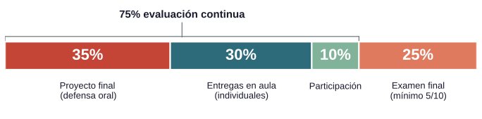

## Técnicas Avanzadas de Predicción en Negocios {.course-cover .center background-color="#447099"}

::: {.course-subtitle}
Presentación curso 2026/27
:::

::: {.course-author}
Juan D. Montoro-Pons
:::

::: {.course-affiliation}
Métodos Cuantitativos para la Economía y la Empresa, Universitat de València
:::

::: {.course-email}
[juan.d.montoro@uv.es](mailto:juan.d.montoro@uv.es)
:::

## ¿Cómo encuentra caras una cámara?

&nbsp;

:::{.hook}
{fig-alt="La cámara encuadra varias caras del cuadro de Sorolla, pero deja otras sin marcar."}
:::

:::{.notes}
Gancho (1 min). Señalar una cara marcada y otra sin marcar. Preguntar qué ejemplos podría haber necesitado un detector para reconocer caras también en un cuadro.

La imagen permite observar detecciones, pero no conocer el entrenamiento de esta cámara concreta. Presentar el aprendizaje a partir de ejemplos como explicación del enfoque, sin atribuirle un conjunto de entrenamiento específico. Puente: en negocios también usamos información observable para predecir algo desconocido.
:::

## Información práctica

&nbsp;

- Correo electrónico: [juan.d.montoro@uv.es](mailto:juan.d.montoro@uv.es)
- Despacho: 2E02 (Facultad de Economía, 2.º piso, Departamento de Economía Aplicada).
- Horario de tutorías: consultad el Aula Virtual.
- Docencia presencial. Guía docente y organización de la asignatura en el Aula Virtual.

::: {.callout-important title="Asistencia"}
Si alguien no puede asistir a clase, debe ponerse en contacto conmigo para prever el enfoque de evaluación.
:::

## Introducción

&nbsp;

La asignatura aborda métodos avanzados de aprendizaje estadístico y su aplicación a problemas de empresa y negocios.

- **Punto de partida:** análisis exploratorio, minería de datos, inferencia y predicción con datos transversales y temporales.
- **Trabajo del curso:** implementar, comparar e interpretar modelos para responder a una pregunta de negocio.
- **Predicción y explicación:** explicar una relación o estimar el efecto de una intervención requieren preguntas y supuestos distintos.

::: {.callout-tip title="Ejemplo"}
Predecir riesgo de abandono (*churn*) frente a evaluar a qué clientes dirigir una campaña de retención.
:::

## Objetivos

&nbsp; 

- Comprender los fundamentos y las aplicaciones de las técnicas avanzadas de aprendizaje estadístico.
- Implementar y comparar modelos de regresión y clasificación sobre datos reales.
- Seleccionar modelos con una evaluación rigurosa y métricas adecuadas al problema.
- Interpretar resultados, incertidumbre y limitaciones para apoyar decisiones empresariales.
- Distinguir preguntas con contenido predictivo de preguntas con contenido explicativo (causales) y discutir los supuestos de estas últimas.
- Desarrollar un trabajo reproducible, con atención a los sesgos y uso crítico y declarado de la IA.

## Contenidos

&nbsp; 

1. Fundamentos del aprendizaje estadístico.
2. Selección y evaluación de modelos.
3. Modelo lineal generalizado con regularización.
4. Ensambles: random forest, XGBoost y *stacking*.
5. Máquinas de vectores de soporte (SVM).
6. Redes neuronales y aprendizaje profundo (Keras).
7. Predicción y efectos causales (DoubleML).

## Cronograma {.table-slide}

&nbsp; 

::: {tbl-colwidths="[10,43,47]"}
| Semanas | Tema | Trabajo en las prácticas |
|:--:|:--|:--|
| 1 | 1. Fundamentos | Entorno de trabajo reproducible |
| 2–3 | 2. Selección y evaluación | Validación cruzada e hiperparámetros |
| 4–5 | 3. GLM con regularización | Modelo base sobre el caso de referencia |
| 6–8 | 4. Ensambles | Comparación con el modelo base |
| 9 | 5. SVM | Comparación entre familias de modelos |
| 10–12 | 6. Redes neuronales y aprendizaje profundo | Implementación con Keras |
| 13–14 | 7. Predicción y efectos causales | Simulación de sesgos y aplicación de DoubleML |
| 14 | Evaluación | Defensa oral del proyecto (sesión de prácticas) |
:::

::: {.callout-note title="Planificación orientativa"}
Sujeta a cambios.
:::

## Recursos

&nbsp; 

- **Materiales del curso:** presentaciones, notas y ejemplos de código en el Aula Virtual.
- **Prácticas:** notebooks guiados, ejercicios y datos reales.
- **Software:** `Python`, `scikit-learn`, `Keras` y `DoubleML`.
- **Entorno:** `Jupyter` y entorno `conda` para la asignatura, con configuración documentada para reproducir el trabajo.
- **Apoyo al aprendizaje:** simulaciones, visualizaciones, cuestionarios y actividades de autoevaluación.
- **Bibliografía:** James et al., *An Introduction to Statistical Learning: with Applications in Python* (2023), lecturas específicas y documentación de las bibliotecas.

## Metodología

&nbsp; 

- **1 h semanal de teoría:** presentación del problema, conceptos y discusión.
- **3 h semanales de prácticas:** notebook guiado, trabajo autónomo y entregas.
- **90 h de trabajo no presencial** durante el cuatrimestre: estudio, ejercicios y proyecto.

Las actividades parten de una pregunta de negocio, exploran los datos y comparan métodos para interpretar los resultados y fundamentar una decisión.

::: {.callout-note title="6 ECTS"}
150 h de trabajo total, con 60 h presenciales.
:::

## Trabajo en las prácticas

&nbsp; 

- Aplicaremos las técnicas a un **mismo conjunto de datos de referencia** para comparar los modelos en un contexto común.
- Trabajaremos en `Python`, transfiriendo los conceptos ya aprendidos con `R`.
- Utilizaremos notebooks que integren código, resultados y explicación de las decisiones.
- Documentaremos el entorno y el proceso de análisis para que el trabajo pueda reproducirse.
- Además del trabajo individual, habrá un proyecto en grupo que se desarrollará, en paralelo a las prácticas. Cada grupo elige su pregunta y conjunto de datos.

## Evaluación {.table-slide}

&nbsp; 

::: {tbl-colwidths="[22,66,12]"}
| Categoría | Descripción | Peso |
|:--|:--|:--:|
| **Proyecto** | Problema de predicción en negocios, desarrollado en grupos de **3–4 estudiantes**. Repositorio reproducible, memoria y defensa oral con participación de todos los miembros. | **35 %** |
| **Entregas individuales** | Tareas desarrolladas y entregadas durante las clases prácticas. Su entrega presupone presencialidad en el aula.  | **30 %** |
| **Participación en clase** | Asistencia regular y participación. | **10 %** |
| **Examen final** | Examen escrito con cuestiones teóricas y prácticas. Se requiere una puntuación mínima de **5 sobre 10** para aprobar la asignatura. | **25 %** |
:::

::: {.callout-important}
Por su naturaleza, la evaluación continua (proyecto, entregas y participación) es **no recuperable**.
:::

## Evaluación

&nbsp; 

{.r-stretch fig-alt="Pesos de la evaluación: proyecto 35 %, entregas 30 %, examen 25 % y participación 10 %."}

::: {.notes}
La evaluación continua suma el 75 % de la nota. El examen representa el 25 % y exige un mínimo de 5/10.
:::

## Proyecto del cuatrimestre

&nbsp; 

- **Grupos de 3–4 estudiantes:** elección de la pregunta de negocio y del conjunto de datos en la semana 2.
- **Desarrollo en paralelo con las prácticas**: exploración, modelo base y comparación de métodos con una evaluación común y justificada.
- **Semana 10:** revisión intermedia con retroalimentación (entrega de ensambles o SVM).
- **Entrega final:** repositorio reproducible, memoria y registro de uso IA, junto con la defensa oral.

::: {.callout-important title="Defensa oral: semana 14"}
Todos los miembros deben estar presentes y participar. Reservad la fecha: semana 14 (última de clase).
:::

## Hitos del proyecto {.table-slide .dense}

&nbsp; 

::: {tbl-colwidths="[12,88]"}
| Semana | Hito |
|:--:|:--|
| 2 | Formación de grupos, pregunta de negocio y elección de datos |
| 4 | Análisis exploratorio de datos (EDA) |
| 6 | Modelo base del proyecto |
| 8 | Ensambles |
| 10 | Revisión intermedia y retroalimentación: comparación de modelos (ensambles o SVM) |
| 14 | Entrega final y defensa oral |
:::

El registro de IA se entrega de forma acumulada. Fechas previstas: fechas e instrucciones concretas se comunicarán a través del Aula Virtual.

::: {.callout-important title="Hito completado"}
Un hito se considera **completado** cuando el grupo presenta un avance válido (no una entrega vacía o simbólica) y recibe retroalimentación del profesor. La falta de hitos completados al llegar a la entrega final reduce la nota global del proyecto (ver Rúbrica del proyecto).
:::

::: {.notes}
El bloque de redes neuronales ocupa las semanas 10–12 y forma parte del recorrido de modelización del proyecto, aunque no tiene un hito independiente en este calendario.
:::

## Rúbrica del proyecto (sintética) {.table-slide .dense}

&nbsp; 

::: {tbl-colwidths="[25,60,15]"}
| Dimensión | Qué se valora | Peso |
|:--|:--|:--:|
| **Formulación y datos** | Pregunta de negocio, elección de datos, predictores admisibles (sin fuga por construcción) y análisis exploratorio | **15 %** |
| **Proyecto reproducible** | Repositorio, entorno y ejecución del análisis sin fugas en el preprocesado | **10 %** |
| **Modelización** | Modelo base y comparación rigurosa de métodos, con selección justificada | **25 %** |
| **Interpretación y comunicación** | Memoria y figuras, lectura de resultados, incertidumbre y utilidad empresarial | **20 %** |
| **Defensa oral individual** | Capacidad para explicar el trabajo y modificar código en vivo | **30 %** |
:::

::: {.callout-warning title="Corrección por hitos no completados"}
De los 5 hitos previos a la entrega final (semanas 2, 4, 6, 8 y 10), cada hito no completado reduce la nota global del proyecto según:

$$
\text{factor} = 0.5 + 0.5 \times \frac{\text{hitos completados}}{5}
$$

Nota final del proyecto = nota de rúbrica × factor. Llegar a la entrega final sin haber completado ningún hito limita la nota del proyecto al 50 % de lo obtenido con la rúbrica.
:::

## Uso de IA y registro {.dense}

&nbsp; 

- Conservad en `registro_ia/` las **conversaciones completas**: prompts, respuestas y contexto relevante, incluidos intentos fallidos o descartados.
- Nombrad cada archivo exportado como `fecha_integrante_herramienta.md` (por ejemplo, `2026-10-03_ana_chatgpt.md`). La conversación es la evidencia; lo demás se contrasta con la memoria, el notebook y en la defensa.
- La versión completa del registro se entrega junto con la entrega final.
- Proteged los datos personales y confidenciales. No introduzcáis secretos ni información no autorizada en servicios externos.
- El registro se contrasta con la memoria y el notebook entregados para comprobar su coherencia. Una incoherencia no penaliza por sí sola: se aclara con el grupo antes de decidir.

::: {.callout-note title="IA permitida, declarada y auditada"}
Podéis utilizar asistentes para programar, depurar, redactar y revisar. Debéis comprobar lo que incorporáis y asumir la responsabilidad del trabajo entregado. **La cantidad de uso de IA declarado no reduce la nota.**
:::

::: {.notes}
Basta con exportar cada conversación tal cual; no hace falta índice ni anotaciones. No se exige registrar conversaciones privadas ajenas al curso. Los detalles del contraste (qué se compara, qué no se considera irregularidad, papel del profesor) van en la guía del proyecto, no en esta clase.
:::
